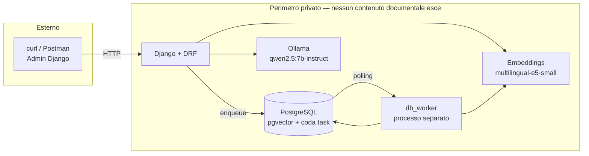
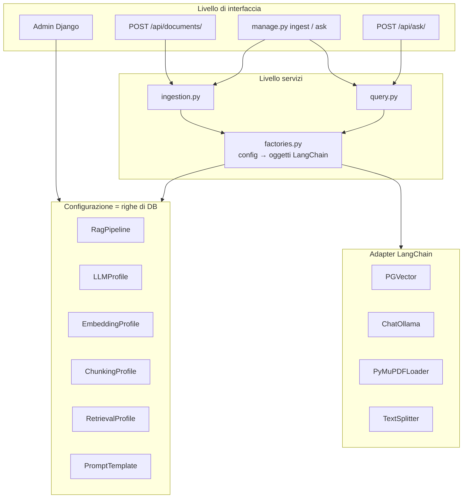
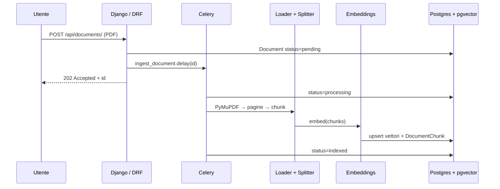
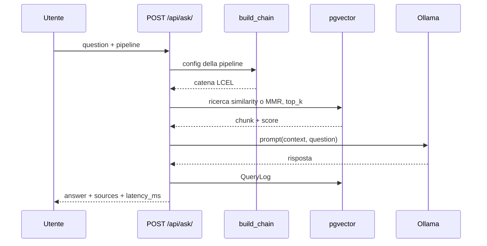
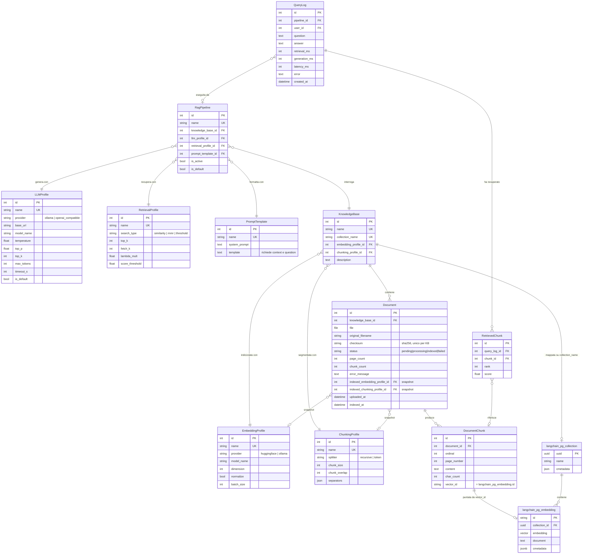

# Architettura — Sistema RAG in Django

Documento di design. Precede l'implementazione descritta in [PLAN.md](PLAN.md).

---

## 1. On-premise o cloud? Cosa chiede davvero la traccia

La traccia impone **un solo vincolo di deployment**, ripetuto due volte:

> «La generazione delle risposte deve avvenire tramite un **LLM privato locale**.»
> «L'LLM deve essere **privato**: puoi usare il modello locale che preferisci, motivando la scelta.»

Il vincolo riguarda **il confine dell'inferenza**, non la geografia dei server.
«Privato» qui significa *che il testo dei documenti non venga elaborato da terzi*,
non necessariamente *che giri sul portatile*. Tre letture possibili:

| Scenario | Ammesso? | Note |
|---|---|---|
| **A.** Tutto in locale (docker-compose sulla macchina) | Sì | Lettura più stretta e più semplice da verificare per chi valuta. **È quella adottata.** |
| **B.** Self-hosted su infrastruttura propria (VPS con GPU, VPC privata) | Sì | Resta «privato»: nessun terzo vede i dati. Stessa architettura, cambia solo dove punta `base_url`. |
| **C.** LLM via API di terzi (OpenAI, Anthropic, Gemini) | **No** | Escluso esplicitamente dalla traccia. |

Sulle **altre** componenti la traccia tace, ma la coerenza logica impone di
estendere il vincolo agli **embedding**: se i chunk dei PDF venissero inviati a
un servizio di embedding cloud, il testo dei documenti uscirebbe comunque dal
perimetro e il requisito sarebbe aggirato, non rispettato. Quindi anche
l'embedding è locale.

Postgres e Redis sono infrastruttura, non elaborazione da parte di terzi: un
Postgres gestito in cloud sarebbe accettabile. Per la prova restano comunque in
docker-compose, così chi valuta avvia tutto con un comando solo.

**Conclusione:** architettura interamente on-premise, ma progettata perché lo
spostamento dell'inferenza su un server GPU proprio sia un cambio di
configurazione dall'admin (`LLMProfile.base_url`), non una modifica al codice.

---

## 2. Vista di deployment



Un solo servizio con stato: **PostgreSQL**, che tiene dati applicativi, vettori
e coda dei task. Ollama è un processo di inferenza senza stato persistente.

---

## 3. Architettura logica

Tre livelli, con il **factory layer** come cerniera: è l'unico punto che traduce
righe di configurazione in oggetti LangChain.



Il principio che regge tutta la prova: **nessun parametro è una costante nel
codice**. `build_chain(pipeline)` legge la configurazione a ogni richiesta, con
cache invalidata da un signal `post_save`, così una modifica dall'admin ha
effetto senza riavviare il processo.

---

## 4. Flusso di ingestione



Lo stato è persistito sul `Document`, quindi l'admin mostra sempre il progresso
reale e un fallimento resta ispezionabile (`error_message`) invece di sparire
nei log.

---

## 5. Flusso di interrogazione



---

## 6. Modello dati

### 6.1 Principio di separazione

Le entità di configurazione si dividono in due famiglie, ed è una distinzione
che va rispettata nello schema:

| | Determina | Modificabile a caldo? |
|---|---|---|
| **Configurazione d'indice** — su `KnowledgeBase`<br/>`EmbeddingProfile`, `ChunkingProfile` | Com'è *costruito* l'indice | No: modificarla richiede una reindicizzazione |
| **Configurazione di query** — su `RagPipeline`<br/>`LLMProfile`, `RetrievalProfile`, `PromptTemplate` | Come l'indice viene *interrogato* | Sì: effetto immediato sulla richiesta successiva |

Mettere il chunking sulla pipeline sarebbe un errore: cambiare `chunk_size` non
produce alcun effetto sui documenti già indicizzati, e l'admin mostrerebbe un
parametro che mente. Sta quindi sulla `KnowledgeBase`, e ogni `Document`
conserva uno snapshot dei profili usati al momento dell'indicizzazione: se il
profilo della KB cambia in seguito, l'admin può segnalare i documenti
disallineati e proporne la reindicizzazione.

### 6.2 Diagramma ER



### 6.3 Le due metà dello schema

Lo schema è gestito da **due proprietari diversi**, ed è una distinzione da
tenere presente nelle migrazioni:

- Le tabelle in `snake_case` con PK intera sono **modelli Django**, sotto
  controllo delle migrazioni del progetto.
- `langchain_pg_collection` e `langchain_pg_embedding` sono create e gestite da
  `langchain_postgres.PGVector`. Django non le conosce e non deve
  migrarle. Il ponte tra i due mondi è `DocumentChunk.vector_id`.

### 6.4 Vincoli e cancellazioni

| Relazione | `on_delete` | Motivo |
|---|---|---|
| `RagPipeline` → profili | `PROTECT` | Cancellare un profilo in uso romperebbe la pipeline in silenzio |
| `KnowledgeBase` → `Embedding/ChunkingProfile` | `PROTECT` | Idem, e l'indice diventerebbe non riproducibile |
| `Document` → `KnowledgeBase` | `CASCADE` | Eliminare una KB elimina i suoi documenti |
| `DocumentChunk` → `Document` | `CASCADE` | + hook che rimuove i vettori corrispondenti da pgvector |
| `QueryLog` → `RagPipeline` | `SET_NULL` | Lo storico delle interrogazioni sopravvive alla pipeline |
| `RetrievedChunk` → `DocumentChunk` | `SET_NULL` | Lo storico sopravvive alla cancellazione del documento |

Vincoli a livello di DB:

- `UniqueConstraint(knowledge_base, checksum)` su `Document` — deduplica gli
  upload dello stesso PDF
- `UniqueConstraint(document, ordinal)` su `DocumentChunk`
- `CheckConstraint(chunk_overlap < chunk_size)` su `ChunkingProfile`
- `CheckConstraint(0 <= temperature <= 2)` su `LLMProfile`
- `UniqueConstraint(is_default=True)` parziale su `LLMProfile` e `RagPipeline` —
  un solo default per tipo

### 6.5 Duplicazione consapevole del testo dei chunk

Il testo di ogni chunk esiste **due volte**: in `DocumentChunk.content` e in
`langchain_pg_embedding.document`. È ridondanza accettata di proposito:

- **Pro:** l'admin può ispezionare, cercare e citare i chunk con l'ORM normale;
  le citazioni riportano numero di pagina e ordinale senza interrogare il vector
  store; una reindicizzazione può ripartire dai chunk già calcolati.
- **Contro:** circa il doppio dello spazio per il testo e due scritture da
  mantenere allineate. La riconciliazione avviene in un unico punto
  (`services/ingestion.py`), dentro una transazione.

L'alternativa — tenere tutto solo nei metadata di pgvector — risparmierebbe
spazio ma renderebbe l'admin cieco sul contenuto indicizzato, che è proprio ciò
che la traccia chiede di poter governare.

### 6.6 Come si legge il modello

`RagPipeline` è l'entità che rende il sistema dimostrabile: si creano due
pipeline sulla stessa `KnowledgeBase` — «veloce» (top_k basso, temperatura 0,
modello 3b) e «accurata» (MMR, top_k alto, modello 7b) — e si confrontano
cambiando una tendina, senza toccare il codice né reindicizzare.

---

## 7. Alternative valutate

### 7.1 Servizio di inferenza LLM

| Opzione | Pro | Contro |
|---|---|---|
| **Ollama** ✅ | Installazione in un comando; gestione modelli integrata; `langchain-ollama` è di prima classe; cambiare modello = cambiare una stringa nell'admin | Overhead superiore a vLLM; batching limitato; non pensato per alta concorrenza |
| vLLM | Throughput elevato, continuous batching, API OpenAI-compatibile | Setup CUDA delicato, immagine pesante; sovradimensionato per una prova |
| llama.cpp / llama-server | Leggerissimo, ottimo su CPU, GGUF quantizzati | Gestione modelli manuale, integrazione meno curata |
| transformers in-process | Nessun servizio esterno | Il modello vive nel processo Django: memoria enorme, reload lentissimo, incompatibile con più worker. **Scartato** |
| LM Studio | Ottima GUI | Non scriptabile né containerizzabile. **Scartato** |

### 7.2 Vector store

| Opzione | Pro | Contro |
|---|---|---|
| **pgvector** ✅ | Un solo datastore; coerenza transazionale tra `Document` e vettori; filtri sui metadata in SQL; un solo backup | Dimensione del vettore fissata nello schema; su milioni di vettori un motore dedicato è più veloce |
| Chroma | Zero infrastruttura, ideale per prototipi | Persistenza separata dal DB → rischio di disallineamento; meno maturo |
| FAISS | Ricerca velocissima | In-memory, nessuna persistenza dei metadata, nessun filtro, reindicizzazione a ogni avvio |
| Qdrant | Filtri potenti, prodotto eccellente | Un servizio in più senza un vantaggio concreto a questa scala |

### 7.3 Modello di embedding

| Opzione | Pro | Contro |
|---|---|---|
| **`multilingual-e5-small`** ✅ | Locale; addestrato su più lingue (i PDF sono presumibilmente in italiano); 384 dimensioni = indice compatto | Gira in-process, primo caricamento lento; qualità inferiore ai modelli `large` |
| `nomic-embed-text` via Ollama | Stesso servizio dell'LLM, nessuna dipendenza da torch | 768 dimensioni; prevalentemente inglese |
| Embedding cloud (OpenAI, Cohere) | Qualità superiore, nessun costo computazionale locale | Il testo dei documenti uscirebbe dal perimetro. **Contraddice il requisito** |

### 7.4 Strategia di chunking

| Opzione | Pro | Contro |
|---|---|---|
| **Recursive character** ✅ (default) | Rispetta i confini di paragrafo e frase; nessuna dipendenza extra | Ignora la struttura del documento (tabelle, colonne) |
| Token-based | Allineato alla finestra di contesto, dimensioni prevedibili | Richiede un tokenizer coerente col modello |
| Semantic chunking | Chunk coerenti per significato, retrieval migliore | Costo di embedding all'ingestione molto più alto |
| Layout-aware (`unstructured`) | Gestisce tabelle e layout multicolonna | Dipendenze pesanti (OCR, poppler), ingestione lenta |

Recursive e token-based sono entrambi esposti come valori dell'enum
`ChunkingProfile.splitter`: la scelta resta configurabile a runtime.

### 7.5 Elaborazione asincrona

| Opzione | Pro | Contro |
|---|---|---|
| **`django.tasks` + `django-tasks-db`** ✅ | API nella stdlib da Django 6.0, **agnostica rispetto al backend**; la coda vive in Postgres, quindi nessun servizio in più; un solo datastore da avviare e da salvare | Il worker fa polling sul DB; niente scheduling né retry ricchi nell'API core; pacchetto community per il worker |
| Celery + Redis | Standard di fatto, retry, monitoring maturo | Un servizio con stato in più; **Postgres non è un broker supportato** (il transport SQLAlchemy di kombu è di fatto abbandonato), quindi Redis diventa obbligatorio |
| procrastinate | Nativo Postgres con `LISTEN/NOTIFY`: nessun polling, retry e locking solidi | Meno diffuso, API propria non agnostica |
| django-q2 | Usa l'ORM come broker, semplice | Rimpiazzato in prospettiva da `django.tasks`; ecosistema più piccolo |
| Sincrono nella request | Semplicissimo | Timeout HTTP su PDF di centinaia di pagine |
| `threading.Thread` | Nessuna dipendenza | Nessuna durabilità: un riavvio perde il lavoro |

Scelta: **`django.tasks` con backend database**. Il vantaggio decisivo non è
tanto risparmiare un container, quanto che l'API è disaccoppiata dalla coda: il
passaggio a Celery e Redis, se il carico lo richiedesse, è una voce di
`settings.TASKS` e non una riscrittura del codice di ingestione. È la stessa
tesi che regge tutto il progetto — il comportamento è configurazione — estesa al
livello delle code.

Con `ImmediateBackend` in fase di sviluppo il progetto gira senza worker
separato, così chi valuta può provarlo con un solo processo.

Limiti da dichiarare: il polling introduce latenza di partenza dell'ordine del
secondo, e a throughput elevato la tabella dei task diventerebbe un punto di
contesa. Per un carico fatto di poche ingestioni di PDF è ampiamente
sufficiente; per una coda ad alta frequenza servirebbe un broker vero.

### 7.6 Dove vive la configurazione

| Opzione | Pro | Contro |
|---|---|---|
| **Modelli Django** ✅ | Admin nativo, validazione in `clean()`, relazioni, storico via migrazioni | Più codice iniziale |
| django-constance | Rapidissimo per flag globali | Coppie chiave/valore piatte: niente profili multipli, niente relazioni |
| `settings.py` / variabili d'ambiente | Semplice, versionato | Richiede riavvio e accesso al codice. **Contraddice il requisito** |
| Un unico `JSONField` | Massima flessibilità | Nessuna validazione, nessuna UI decente, refactoring a mano |

### 7.7 Strategia di retrieval

| Opzione | Pro | Contro |
|---|---|---|
| **Similarity** ✅ (default) | Baseline solida, prevedibile | Può restituire chunk quasi identici |
| **MMR** ✅ (opzione) | Diversifica i risultati, utile su PDF ripetitivi | Due parametri in più da tarare (`fetch_k`, `lambda_mult`) |
| Ibrido BM25 + vettoriale | Molto meglio su codici, sigle, nomi propri | Richiede un indice full-text parallelo. **Fuori scope** |
| Reranker cross-encoder | Miglioramento netto della precisione | Raddoppia la latenza, un modello in più da servire. **Fuori scope** |

### 7.8 Osservabilità e tracing

| Opzione | Pro | Contro |
|---|---|---|
| **`QueryLog` + `RetrievedChunk` nativi** ✅ | Zero infrastruttura aggiuntiva; visibili **nell'admin Django**, cioè dove la traccia chiede che il sistema sia governabile; interrogabili con l'ORM per analisi aggregate | Nessun tracing annidato per singolo step della catena; nessun conteggio dei token; UI spartana |
| Langfuse self-hosted | Tracing per step, conteggio token, dataset e valutazioni, UI matura; interamente FOSS e installabile nel perimetro privato | **Sei container** (web, worker, Postgres, ClickHouse, Redis, MinIO), minimo raccomandato 4 vCPU e 8 GB di RAM — accanto a un modello 7B su GPU. Sproporzionato rispetto al peso che la traccia dà all'osservabilità |
| Langfuse Cloud | Nessuna infrastruttura da gestire | Le tracce contengono il prompt completo, quindi i chunk estratti dai PDF: il testo dei documenti uscirebbe dal perimetro. **Contraddice la premessa del progetto** |
| Arize Phoenix | Container singolo, OpenTelemetry, valutazioni RAG native (groundedness, rilevanza dei chunk) | Un servizio comunque in più; funzionalità di prompt management assenti |
| OpenTelemetry / OpenLLMetry puro | Leggerissimo, esporta verso qualunque backend già presente | Richiede un backend di raccolta per essere utile |

Decisione: **osservabilità nativa nei modelli Django**, più un punto di aggancio
per Langfuse dietro il flag `LANGFUSE_ENABLED`, disattivato di default e con un
profilo docker-compose dedicato. Il costo è di circa un'ora e l'integrazione
resta dimostrabile senza imporre a chi valuta un `docker compose up` da 8 GB.

```python
# rag/services/callbacks.py
def get_callbacks(pipeline):
    if not settings.LANGFUSE_ENABLED:
        return []
    from langfuse.langchain import CallbackHandler
    return [CallbackHandler(metadata={"pipeline": pipeline.name})]
```

**Nota deliberata:** anche attivando Langfuse, la sua funzione di *prompt
management* resta inutilizzata. I prompt devono vivere in `PromptTemplate` e
essere modificabili dall'admin Django: spostarli altrove svuoterebbe proprio il
requisito centrale della traccia. Langfuse qui è osservabilità, mai
configurazione.

---

## 8. Compromessi accettati

1. **La dimensione dell'embedding è un vincolo di schema.** In pgvector la
   colonna è tipizzata `vector(384)`. Modificare `EmbeddingProfile` su una
   `KnowledgeBase` già popolata romperebbe l'indice: il modello è quindi
   immutabile finché esistono documenti indicizzati, ed è prevista un'azione
   admin «ricostruisci collezione» che reindicizza tutto.
2. **`base_url` modificabile dall'admin** è ciò che rende il sistema
   configurabile, ma consente a un amministratore di puntare l'inferenza verso
   un host arbitrario. Accettabile qui (l'admin è già un ruolo fidato); in
   produzione andrebbe limitato a una allow-list.
3. **Nessuna valutazione quantitativa della qualità** (RAGAS o simili): senza un
   dataset di riferimento sarebbe un numero senza significato. I `QueryLog`
   conservano però domanda, chunk recuperati e score, cioè la materia prima per
   costruirla.
4. **Nessuna gestione multi-utente sui documenti.** Ogni utente autenticato vede
   l'intera base di conoscenza.
5. **PDF scansionati non supportati.** PyMuPDF estrae testo, non fa OCR: un PDF
   di sole immagini produce zero chunk. Il caso è rilevato e segnalato come
   errore esplicito invece di generare un documento vuoto e silenzioso.

## 9. Fuori scope dichiarato

Reranking, ricerca ibrida, streaming SSE, memoria conversazionale,
multi-tenancy, ACL a livello di chunk, OCR.
