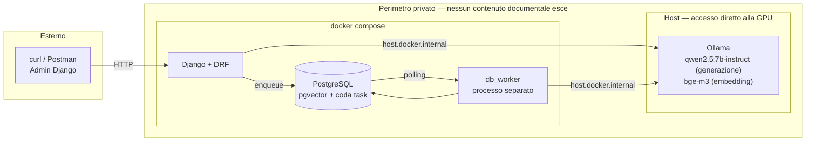
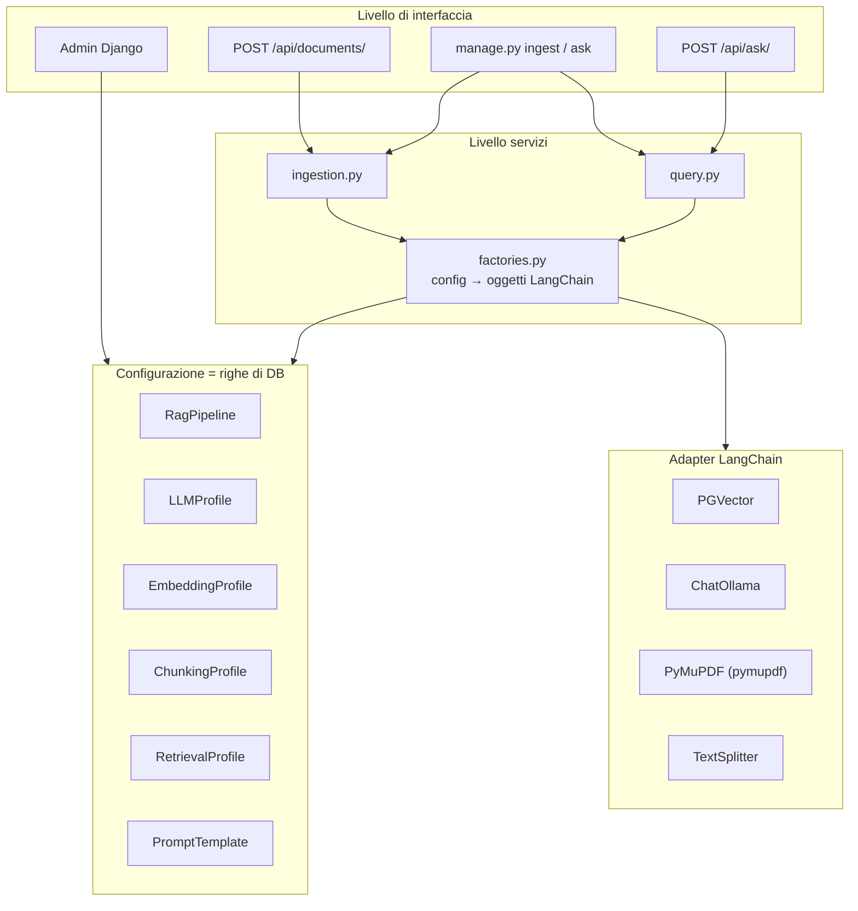
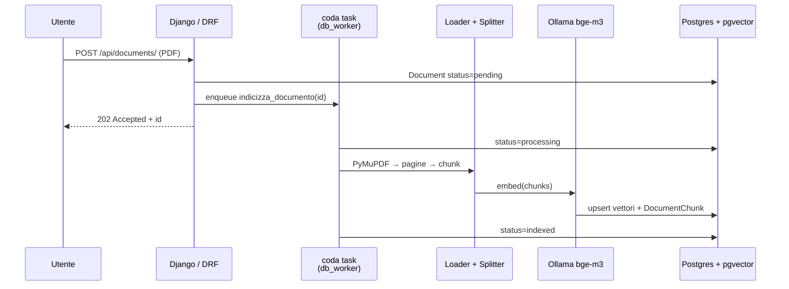
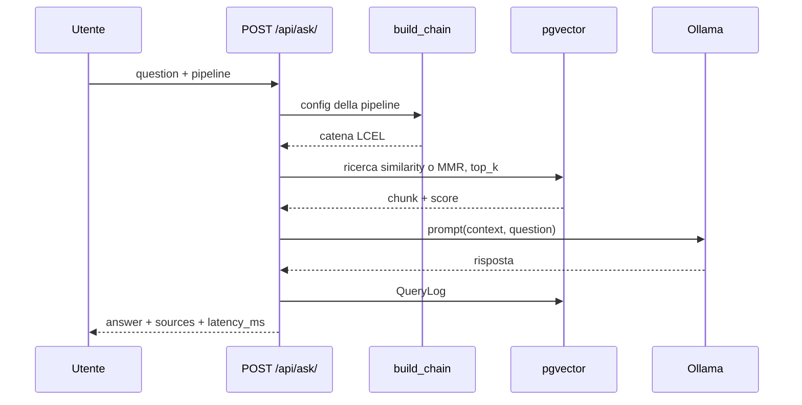
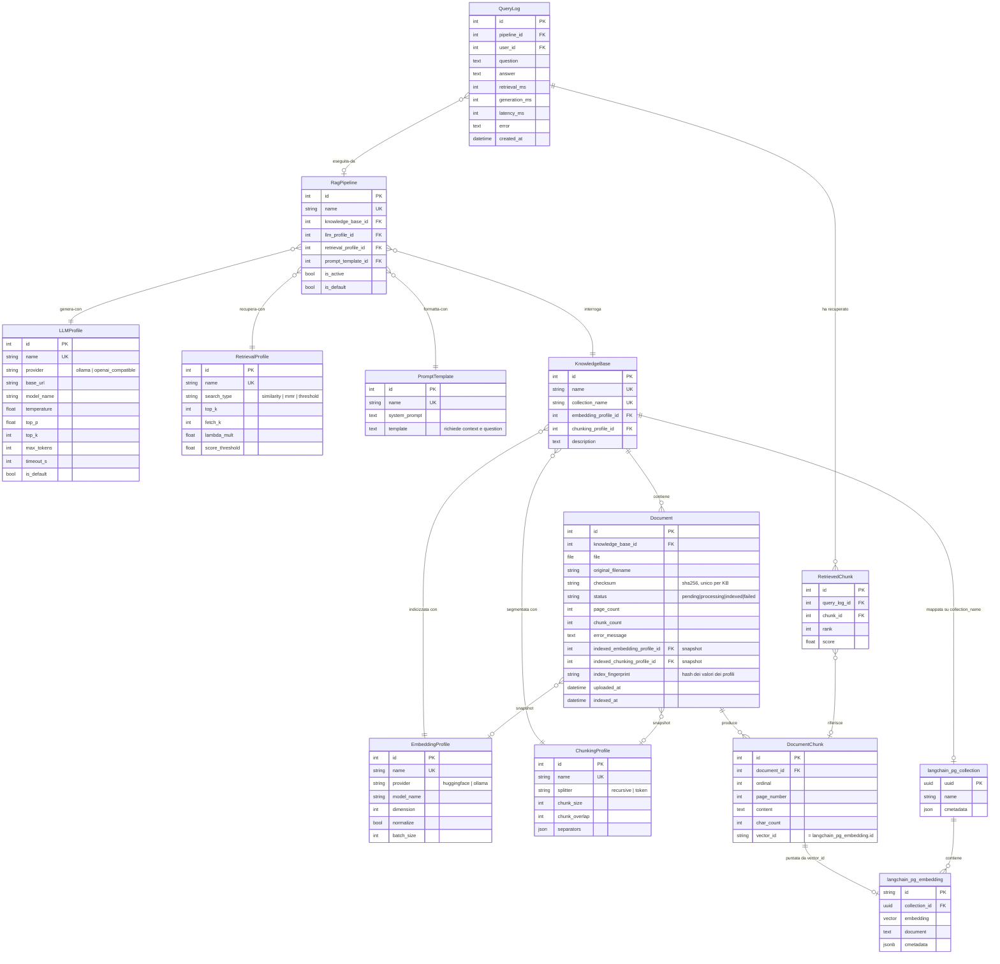

# Architettura — Sistema RAG in Django

Documento di design. Precede l'implementazione descritta in [PLAN.md](PLAN.md).

---

## 1. On-premise o cloud? Cosa chiede davvero la traccia

La traccia impone **un solo vincolo di deployment**, ripetuto due volte:

> «La generazione delle risposte deve avvenire tramite un **LLM privato locale**.»
> «L'LLM deve essere **privato**: puoi usare il modello locale che preferisci, motivando la scelta.»

Il vincolo riguarda **il confine dell'inferenza**, non la geografia dei server.
«Privato» qui significa *che il testo dei documenti non venga elaborato da terzi*,
non necessariamente *che giri sul portatile*. Tre letture possibili:

| Scenario | Ammesso? | Note |
|---|---|---|
| **A.** Tutto in locale (docker-compose sulla macchina) | Sì | Lettura più stretta e più semplice da verificare per chi valuta. **È quella adottata.** |
| **B.** Self-hosted su infrastruttura propria (VPS con GPU, VPC privata) | Sì | Resta «privato»: nessun terzo vede i dati. Stessa architettura, cambia solo dove punta `base_url`. |
| **C.** LLM via API di terzi (OpenAI, Anthropic, Gemini) | **No** | Escluso esplicitamente dalla traccia. |

Sulle **altre** componenti la traccia tace, ma la coerenza logica impone di
estendere il vincolo agli **embedding**: se i chunk dei PDF venissero inviati a
un servizio di embedding cloud, il testo dei documenti uscirebbe comunque dal
perimetro e il requisito sarebbe aggirato, non rispettato. Quindi anche
l'embedding è locale.

Postgres è infrastruttura, non elaborazione da parte di terzi: un Postgres
gestito in cloud sarebbe accettabile. Per la prova resta comunque in
docker-compose, così chi valuta avvia tutto con un comando solo. Non c'è alcun
Redis: la coda dei task vive nello stesso Postgres (cfr. §7.5).

**Conclusione:** architettura interamente on-premise, ma progettata perché lo
spostamento dell'inferenza su un server GPU proprio sia un cambio di
configurazione dall'admin (`LLMProfile.base_url`), non una modifica al codice.

---

## 2. Vista di deployment



Un solo servizio con stato: **PostgreSQL**, che tiene dati applicativi, vettori
e coda dei task. Ollama è un processo di inferenza senza stato persistente, e
serve **entrambi** i modelli: generazione ed embedding passano dallo stesso
servizio, quindi il progetto non ha alcuna dipendenza da torch.

Ollama **non è containerizzato**: su Windows il passthrough della GPU verso
Docker richiederebbe WSL2 e nvidia-container-toolkit. Gira nativamente
sull'host e i container lo raggiungono via `host.docker.internal`. Resta dentro
il perimetro privato — «privato» riguarda il confine dell'inferenza, non il
confine di Compose.

---

## 3. Architettura logica

Tre livelli, con il **factory layer** come cerniera: è l'unico punto che traduce
righe di configurazione in oggetti LangChain.



Il principio che regge tutta la prova: **nessun parametro è una costante nel
codice**. `build_chain(pipeline)` legge la configurazione a ogni richiesta, così
una modifica dall'admin ha effetto senza riavviare il processo.

Ciò che rende vera quell'affermazione, dalla P3, è la **chiave** della cache
delle factory, non il signal. Sono memorizzati i due oggetti costosi — l'LLM e
il vector store, 0,77 s e 0,83 s di costruzione misurati — e la loro chiave
contiene i **valori** della configurazione (`updated_at` del profilo,
`index_fingerprint()` della base di conoscenza), non solo la chiave primaria.
Chi interroga rilegge comunque quelle righe a ogni richiesta, quindi vede subito
il valore nuovo **anche in un processo che il `post_save` non lo riceve mai**,
cioè con più worker. Il receiver di `rag/signals.py` libera memoria e rende
l'effetto immediato nel processo che ha salvato: è utile, non è la garanzia.
La distinzione conta perché chi la ignorasse replicherebbe la forma senza la
sostanza.

---

## 4. Flusso di ingestione



Lo stato è persistito sul `Document`, quindi l'admin mostra sempre il progresso
reale e un fallimento resta ispezionabile (`error_message`) invece di sparire
nei log.

Il diagramma è il sistema da P5 (T-32). Gli inneschi dell'ingestione — admin,
azione «Reindicizza», `POST /api/documents/` — passano tutti da
`rag.tasks.accoda_indicizzazione()`, che porta il documento a «In attesa» e
accoda; `ingest_document()` la chiama il worker. L'unica via sincrona rimasta è
`manage.py ingest` senza `--async`, dove attendere è esattamente ciò che si
vuole (RNF-03 parla del ciclo richiesta/risposta HTTP, di cui un comando di
gestione non fa parte).

Misure prese con `curl` contro un `runserver` vero: l'upload rispondeva in
**14,53 s** a freddo e **4,25 s** a caldo quando indicizzava in linea, e da P5
risponde **202** in **0,94 s** — di cui circa 0,9 s sono l'avvio del processo
`curl`, la connessione e l'autenticazione Basic, costanti e misurati anche sul
409 (0,92 s). Il lavoro non è sparito: lo stesso documento è costato **12,4 s**
al worker a freddo e **2,7 s** a caldo.

Da qui «In elaborazione» diventa uno stato **osservabile davvero**, e non più
solo a metà: lo scrive il worker in autocommit, fuori da qualunque transazione
di richiesta. Verificato dal vivo con un `GET /api/documents/{id}/` ogni 150 ms
durante un'indicizzazione, che ha visto la sequenza `pending → processing →
indexed`. Prima di P5 l'admin avvolgeva l'intero POST in una transazione propria
(`ModelAdmin.changeform_view`) e quella scrittura diventava visibile solo al
commit, cioè a lavoro già concluso.

Il rovescio dichiarato: se **nessun worker è in esecuzione** il documento resta
«In attesa» a tempo indeterminato — misurato, ancora `pending` dopo 15 s — senza
alcun fallimento. È il modo più probabile di sbagliare l'avvio del progetto, ed
è la ragione per cui `/health` porta la voce «coda» (T-34), che dice quanti task
attendono e chi deve lavorarli.

---

## 5. Flusso di interrogazione



**Stato attuale.** L'endpoint è P4 (T-30): oggi l'unico ingresso è
`manage.py ask "<domanda>"` (T-27), che chiama `rispondi()` in
`rag/services/query.py`. Il diagramma resta il bersaglio, e il servizio è
scritto perché P4 debba solo esporlo via HTTP.

Tre precisazioni che il diagramma non può contenere, tutte decise in P3:

- **il recupero sta fuori dalla catena**, prima di essa. La catena LCEL è
  `prompt | llm | StrOutputParser` e nient'altro, perché `QueryLog` vuole
  `retrieval_ms` e `generation_ms` **separati** — in P0 si è misurato un
  recupero da 12 s accanto a una generazione da 1. Dentro un'unica catena i due
  tempi sarebbero distinguibili solo con dei callback;
- **sotto soglia l'LLM non viene interrogato affatto.** Zero segmenti dopo il
  filtro significa risposta di non conoscenza con `generation_ms = 0` e nessuna
  fonte: è l'unica forma di RF-14 che non dipenda dall'obbedienza del modello al
  prompt. Vale anche per una base di conoscenza vuota;
- **il punteggio restituito è la rilevanza, non la distanza** (§7.9).

Il `QueryLog` si scrive **sempre**, anche quando l'interrogazione fallisce: è la
stessa scelta che in ingestione persiste lo stato «Fallito» invece di lasciarlo
nei log.

---

## 6. Modello dati

### 6.1 Principio di separazione

Le entità di configurazione si dividono in due famiglie, ed è una distinzione
che va rispettata nello schema:

| | Determina | Modificabile a caldo? |
|---|---|---|
| **Configurazione d'indice** — su `KnowledgeBase`<br/>`EmbeddingProfile`, `ChunkingProfile` | Com'è *costruito* l'indice | No: modificarla richiede una reindicizzazione |
| **Configurazione di query** — su `RagPipeline`<br/>`LLMProfile`, `RetrievalProfile`, `PromptTemplate` | Come l'indice viene *interrogato* | Sì: effetto immediato sulla richiesta successiva |

Mettere il chunking sulla pipeline sarebbe un errore: cambiare `chunk_size` non
produce alcun effetto sui documenti già indicizzati, e l'admin mostrerebbe un
parametro che mente. Sta quindi sulla `KnowledgeBase`, e ogni `Document`
conserva uno snapshot dei profili usati al momento dell'indicizzazione: se il
profilo della KB cambia in seguito, l'admin può segnalare i documenti
disallineati e proporne la reindicizzazione.

**Come si rileva il disallineamento.** Due implementazioni possibili dello
stesso principio:

| | Meccanismo | Valutazione |
|---|---|---|
| **FK-snapshot** — *per la leggibilità* | `Document.indexed_embedding_profile` e `indexed_chunking_profile` puntano ai profili usati | Ispezionabile nell'admin: si vede *quale* profilo era attivo. Ma da solo non basta come criterio: se un profilo viene **modificato sul posto** l'FK resta uguale e il disallineamento sfugge |
| **Fingerprint** — *per il criterio* | Un hash dei *valori* dei due profili, salvato sul `Document` e ricalcolato al confronto | Un solo campo, e coglie anche la modifica sul posto — che è il caso realistico, visto che l'admin edita i profili esistenti invece di crearne di nuovi. Ma un hash non dice *cosa* è cambiato |

Si adottano **entrambi**: gli FK per la leggibilità nell'admin, il fingerprint
come criterio effettivo di `needs_reindex`. Il costo è un `CharField` in più
(T-09).

### 6.2 Diagramma ER



### 6.3 Le due metà dello schema

Lo schema è gestito da **due proprietari diversi**, ed è una distinzione da
tenere presente nelle migrazioni:

- Le tabelle in `snake_case` con PK intera sono **modelli Django**, sotto
  controllo delle migrazioni del progetto.
- `langchain_pg_collection` e `langchain_pg_embedding` sono create e gestite da
  `langchain_postgres.PGVector`. Django non le conosce e non deve
  migrarle. Il ponte tra i due mondi è `DocumentChunk.vector_id`.

### 6.4 Vincoli e cancellazioni

| Relazione | `on_delete` | Motivo |
|---|---|---|
| `RagPipeline` → profili | `PROTECT` | Cancellare un profilo in uso romperebbe la pipeline in silenzio |
| `KnowledgeBase` → `Embedding/ChunkingProfile` | `PROTECT` | Idem, e l'indice diventerebbe non riproducibile |
| `Document` → `KnowledgeBase` | `CASCADE` | Eliminare una KB elimina i suoi documenti |
| `DocumentChunk` → `Document` | `CASCADE` | + hook che rimuove i vettori corrispondenti da pgvector |
| `QueryLog` → `RagPipeline` | `SET_NULL` | Lo storico delle interrogazioni sopravvive alla pipeline |
| `RetrievedChunk` → `DocumentChunk` | `SET_NULL` | Lo storico sopravvive alla cancellazione del documento |

L'hook della quarta riga vive in `rag/signals.py`: `pre_delete` raccoglie i
`vector_id` finché le righe `DocumentChunk` esistono — il collector cancella i
figli prima del padre, quindi in `post_delete` sarebbero già spariti — e
`post_delete` ne programma la rimozione da pgvector con
`transaction.on_commit()` (§6.5). Scatta **anche in cascata dalla
`KnowledgeBase`**, perché la sola presenza di ricevitori esclude il *fast
delete* del collector. Non rimuove invece il PDF da `MEDIA_ROOT`: è il
comportamento predefinito di Django, ed è un limite dichiarato, non una svista.
Allo stesso modo, cancellare una `KnowledgeBase` porta via i suoi vettori ma
lascia la riga corrispondente in `langchain_pg_collection` — verificato: una
collezione vuota e senza proprietario, innocua per il retrieval ma da conoscere
prima di leggere quella tabella come inventario delle basi attive.

La base di conoscenza di un documento, invece, è modificabile **solo al
caricamento**: cfr. `DocumentAdmin.get_readonly_fields()`. Spostare un documento
già indicizzato lo renderebbe invisibile in silenzio — i vettori resterebbero
nella collezione di partenza, «disallineato» non se ne accorgerebbe perché
confronta i valori dei profili e non l'identità della base, e nemmeno una
reindicizzazione rimedierebbe, visto che l'upsert non riscrive `collection_id`
(§7.9). Per spostare un documento lo si cancella e lo si ricarica.

Vincoli a livello di DB:

- `UniqueConstraint(knowledge_base, checksum)` su `Document` — deduplica gli
  upload dello stesso PDF
- `UniqueConstraint(document, ordinal)` su `DocumentChunk`
- `CheckConstraint(chunk_overlap < chunk_size)` su `ChunkingProfile`
- `CheckConstraint(0 <= temperature <= 2)` su `LLMProfile`
- `UniqueConstraint(is_default=True)` parziale su `LLMProfile` e `RagPipeline` —
  un solo default per tipo

### 6.5 Duplicazione consapevole del testo dei chunk

Il testo di ogni chunk esiste **due volte**: in `DocumentChunk.content` e in
`langchain_pg_embedding.document`. È ridondanza accettata di proposito:

- **Pro:** l'admin può ispezionare, cercare e citare i chunk con l'ORM normale;
  le citazioni riportano numero di pagina e ordinale senza interrogare il vector
  store; una reindicizzazione può ripartire dai chunk già calcolati.
- **Contro:** circa il doppio dello spazio per il testo e due scritture da
  mantenere allineate. La riconciliazione avviene in un unico punto
  (`services/ingestion.py`), ma **non** dentro un'unica transazione: le due
  metà stanno su due connessioni distinte — l'ORM di Django e l'engine
  SQLAlchemy di `PGVector` — e nessun `transaction.atomic()` le comprende
  entrambe. È il prezzo dichiarato in §7.9.

Al posto dell'atomicità il progetto garantisce **l'ordine delle scritture**:
prima i vettori in pgvector (upsert idempotente), poi le righe Django in
`transaction.atomic()`. Se cade la seconda metà restano **vettori orfani**:
invisibili al sistema, ricalcolabili, e sovrascritti dalla prossima
indicizzazione perché gli id sono deterministici — `"<document_id>:<ordinal>"`.
Il guasto si ripara da solo. L'ordine inverso lascerebbe chunk che puntano a
vettori inesistenti, cioè un indice che mente al retrieval: un guasto
silenzioso e permanente. In cancellazione la direzione del rischio si rovescia,
ed è il motivo del `transaction.on_commit()` di §6.4 — la rimozione dei vettori
è rinviata al commit perché un rollback di Django non lasci un documento vivo
**senza** i suoi vettori.

L'alternativa — tenere tutto solo nei metadata di pgvector — risparmierebbe
spazio ma renderebbe l'admin cieco sul contenuto indicizzato, che è proprio ciò
che la traccia chiede di poter governare.

### 6.6 Come si legge il modello

`RagPipeline` è l'entità che rende il sistema dimostrabile: si creano due
pipeline sulla stessa `KnowledgeBase` — «veloce» (top_k basso, temperatura 0,
modello 3b) e «accurata» (MMR, top_k alto, modello 7b) — e si confrontano
cambiando una tendina, senza toccare il codice né reindicizzare.

---

## 7. Alternative valutate

### 7.1 Servizio di inferenza LLM

| Opzione | Pro | Contro |
|---|---|---|
| **Ollama** ✅ | Installazione in un comando; gestione modelli integrata; `langchain-ollama` è di prima classe; cambiare modello = cambiare una stringa nell'admin | Overhead superiore a vLLM; batching limitato; non pensato per alta concorrenza |
| vLLM | Throughput elevato, continuous batching, API OpenAI-compatibile | Setup CUDA delicato, immagine pesante; sovradimensionato per una prova |
| llama.cpp / llama-server | Leggerissimo, ottimo su CPU, GGUF quantizzati | Gestione modelli manuale, integrazione meno curata |
| transformers in-process | Nessun servizio esterno | Il modello vive nel processo Django: memoria enorme, reload lentissimo, incompatibile con più worker. **Scartato** |
| LM Studio | Ottima GUI | Non scriptabile né containerizzabile. **Scartato** |

### 7.2 Vector store

| Opzione | Pro | Contro |
|---|---|---|
| **pgvector** ✅ | Un solo datastore; coerenza transazionale tra `Document` e vettori; filtri sui metadata in SQL; un solo backup | Dimensione del vettore fissata nello schema; su milioni di vettori un motore dedicato è più veloce |
| Chroma | Zero infrastruttura, ideale per prototipi | Persistenza separata dal DB → rischio di disallineamento; meno maturo |
| FAISS | Ricerca velocissima | In-memory, nessuna persistenza dei metadata, nessun filtro, reindicizzazione a ogni avvio |
| Qdrant | Filtri potenti, prodotto eccellente | Un servizio in più senza un vantaggio concreto a questa scala |

### 7.3 Modello di embedding

| Opzione | Pro | Contro |
|---|---|---|
| **`bge-m3` via Ollama** ✅ | Multilingua di prima fascia (i PDF sono in italiano); **stesso servizio dell'LLM**, quindi nessuna dipendenza da torch/sentence-transformers (~2,5 GB di wheel risparmiati); nessun caricamento in-process nel worker HTTP | 1024 dimensioni: indice più pesante; ~1,2 GB di VRAM condivisi con il modello di generazione |
| `intfloat/multilingual-e5-small` (HuggingFace) | Buon multilingua, 384 dimensioni = indice compatto | Gira **in-process** via sentence-transformers: torch fra le dipendenze, primo caricamento lento, memoria duplicata per ogni worker |
| `nomic-embed-text` via Ollama | Stesso servizio dell'LLM, 768 dimensioni | Prevalentemente inglese: degraderebbe il retrieval su documenti italiani |
| Embedding cloud (OpenAI, Cohere) | Qualità superiore, nessun costo computazionale locale | Il testo dei documenti uscirebbe dal perimetro. **Contraddice il requisito** |

Scelta: **`bge-m3`**. Il fattore decisivo non è la qualità pura — `e5-small` è
adeguato — ma il fatto che passare da Ollama tiene l'intero progetto libero da
torch e concentra l'inferenza in un solo servizio governabile dall'admin. Le
1024 dimensioni sono il prezzo accettato, irrilevante alla scala di questa prova.

Coerentemente, il provider «huggingface» resta un valore dell'enum
`EmbeddingProfile.provider` ma non è attivabile: `get_embeddings()` lo rifiuta
con `ConfigurazioneNonSupportata`, perché realizzarlo vorrebbe dire
reintrodurre proprio torch. Altri due campi dello stesso profilo vanno letti
con la stessa onestà: `normalize` **non** viene applicato dal codice — `bge-m3`
restituisce già vettori a norma 1,000000 (misurato) e la distanza cosine è
invariante alla scala, quindi normalizzare sarebbe codice dimostrabilmente
inerte — mentre `batch_size` è fatto rispettare dal **servizio di ingestione**,
non dalla factory: `OllamaEmbeddings` non sa batchare e `PGVector.add_texts()`
invia tutti i testi in una sola richiesta (§7.9).

### 7.4 Strategia di chunking

| Opzione | Pro | Contro |
|---|---|---|
| **Recursive character** ✅ (default) | Rispetta i confini di paragrafo e frase; nessuna dipendenza extra | Ignora la struttura del documento (tabelle, colonne) |
| Token-based | Allineato alla finestra di contesto, dimensioni prevedibili | Richiede un tokenizer coerente col modello |
| Semantic chunking | Chunk coerenti per significato, retrieval migliore | Costo di embedding all'ingestione molto più alto |
| Layout-aware (`unstructured`) | Gestisce tabelle e layout multicolonna | Dipendenze pesanti (OCR, poppler), ingestione lenta |

Recursive e token-based sono entrambi esposti come valori dell'enum
`ChunkingProfile.splitter`, ma solo il primo è realizzato: `get_splitter()`
rifiuta il token-based con `ConfigurazioneNonSupportata`. `TokenTextSplitter`
richiederebbe `tiktoken`, che implementa i BPE di OpenAI: dimensionare con
quello i chunk di `qwen2.5` e `bge-m3` significherebbe misurarli col metro di
un altro modello, producendo un conteggio plausibile e falso. Il valore resta
nell'enum come alternativa documentata, e il rifiuto è esplicito invece che
silenzioso.

### 7.5 Elaborazione asincrona

| Opzione | Pro | Contro |
|---|---|---|
| **`django-tasks` + `django-tasks-db`** ✅ | API **agnostica rispetto al backend**, identica a quella entrata nella stdlib con Django 6.0; la coda vive in Postgres, quindi nessun servizio in più; un solo datastore da avviare e da salvare | Il worker fa polling sul DB; niente scheduling né retry ricchi nell'API core; **due** pacchetti community e 19 migrazioni in più |
| Celery + Redis | Standard di fatto, retry, monitoring maturo | Un servizio con stato in più; **Postgres non è un broker supportato** (il transport SQLAlchemy di kombu è di fatto abbandonato), quindi Redis diventa obbligatorio |
| procrastinate | Nativo Postgres con `LISTEN/NOTIFY`: nessun polling, retry e locking solidi | Meno diffuso, API propria non agnostica |
| django-q2 | Usa l'ORM come broker, semplice | Rimpiazzato in prospettiva da `django.tasks`; ecosistema più piccolo |
| Sincrono nella request | Semplicissimo | Timeout HTTP su PDF di centinaia di pagine |
| `threading.Thread` | Nessuna dipendenza | Nessuna durabilità: un riavvio perde il lavoro |

Scelta: **API in stile `django.tasks` con backend database**. Il vantaggio
decisivo non è tanto risparmiare un container, quanto che l'API è disaccoppiata
dalla coda: il passaggio a Celery e Redis, se il carico lo richiedesse, è una
voce di `settings.TASKS` e non una riscrittura del codice di ingestione. È la
stessa tesi che regge tutto il progetto — il comportamento è configurazione —
estesa al livello delle code.

**Precisazione verificata, contro l'assunzione più naturale.** Django 6.0
introduce `django.tasks` nella stdlib, ma ne spedisce **solo i backend
`immediate` e `dummy`**: in `django/tasks/backends/` non esiste alcun backend
database, né un comando worker. Una coda durevole richiede quindi comunque un
pacchetto esterno, e l'unico maturo — `django-tasks-db` — è costruito sopra il
**backport** `django-tasks` (modulo `django_tasks`), non sopra `django.tasks`:
il suo backend importa da `django_tasks.backends.base`.

**Versioni installate: `django-tasks` 0.12.0 e `django-tasks-db` 0.12.0**, cioè
**due** pacchetti e non uno. Fino alla 0.11 i backend `db` e `rq` stavano dentro
`django-tasks`; dalla 0.12.0 sono distribuzioni separate (dichiarato nel README
del pacchetto: «Prior to `0.12.0`, `django-tasks-db` and `django-tasks-rq` were
also included»). È la ragione del vincolo `>=0.12` in `requirements.in`: prima
di quella versione il percorso `django_tasks_db.DatabaseBackend` non esisteva.
Servono **entrambe** le app in `INSTALLED_APPS` — `django_tasks` registra i
propri check e segnali, e `DatabaseBackend.check()` emette un errore esplicito
se `django_tasks_db` non è installata. Le **19 migrazioni** (`0001` → `0019`)
sono tutte della seconda, sotto il `label` `django_tasks_database`, che è
diverso dal nome del modulo; `django_tasks` non ha alcuna directory
`migrations/`.

In pratica, su Django 6 questo significa installare il backport di un framework
già presente nella stdlib, aggiungere `django_tasks` e `django_tasks_db` a
`INSTALLED_APPS` e portarsi 19 migrazioni. La decisione resta valida — è pur
sempre la coda durevole a minor costo infrastrutturale — ma la motivazione
corretta è «coda in Postgres senza servizi in più», **non** «basta la stdlib».

**Il check di `django.tasks` si registra sempre, e non fa danno** — misurato
alla 0.12.0, e correggo qui una nota precedente che diceva il contrario («si
registra solo se lo importa il codice applicativo»). Dopo `django.setup()`,
`"django.tasks" in sys.modules` è **`True`**, e a importarlo sono due terze
parti, entrambe deliberatamente: `django_tasks_db/compat.py:2`
(`from django.tasks.base import Task as DjangoTask`, dentro un `try/except
ImportError`, per `TASK_CLASSES = (Task, DjangoTask)` — il backend DB accetta
sia i `Task` del backport sia quelli della stdlib) e `django_stubs_ext/patch.py:112`.
`django/tasks/checks.py` istanzia quindi il backend da `settings.TASKS` e ne
chiama `check()`: poiché `create_connection()` si limita a `import_string()`,
ottiene la stessa `django_tasks_db.backend.DatabaseBackend`, il cui `check()`
restituisce lista vuota. Due check girano, entrambi passano, `manage.py check`
resta a 0 issues. **La regola operativa non cambia**: nel nostro codice si
importa sempre `django_tasks` (underscore), mai `django.tasks` (punto), perché
i due handler costruiscono **istanze separate** e un task accodato sull'uno non
arriverebbe mai al worker dell'altro.

Con `ImmediateBackend` in fase di sviluppo il progetto gira senza worker
separato, così chi valuta può provarlo con un solo processo: basta
`TASKS_BACKEND=django_tasks.backends.immediate.ImmediateBackend` in `.env`. È
anche il motivo per cui l'asincronia sta in P5 e non prima: se il tempo stringe
si consegna l'ingestione sincrona senza aver introdotto nessuna delle due
dipendenze.

Limiti da dichiarare: il polling introduce latenza di partenza dell'ordine del
secondo, e a throughput elevato la tabella dei task diventerebbe un punto di
contesa. Per un carico fatto di poche ingestioni di PDF è ampiamente
sufficiente; per una coda ad alta frequenza servirebbe un broker vero.

Un limite **misurato** che nasce dal secondo processo: il worker è **a freddo al
primo task** e paga il caricamento del modello di embedding una volta per
processo — `_memoizza()` di `factories.py` è un dizionario di modulo, e ogni
processo ha il proprio. Misura: **12,4 s** per un PDF di 4 pagine al primo task
di un worker appena avviato, **2,7 s** per lo stesso lavoro a caldo. Un worker
riavviato ripaga quel costo. Non è correttezza — la chiave della cache contiene
i *valori* della configurazione, quindi RF-22 vale in entrambi i processi — è
latenza, e va detta a chi cronometra la prima ingestione.

Altri due limiti dichiarati e non risolti: **nessun retry automatico** dei task
falliti (un documento fallito si rielabora con l'azione «Reindicizza», che
esiste già) e **nessun lucchetto** contro il doppio accodamento sullo stesso
documento. Il secondo è una scelta: gli id dei vettori sono deterministici e
l'upsert è `ON CONFLICT (id) DO UPDATE`, quindi due esecuzioni parallele
sprecano lavoro senza perdere correttezza, mentre un `select_for_update()` sul
documento introdurrebbe un modo nuovo di restare bloccati — un worker morto a
metà lascerebbe il documento «In elaborazione» per sempre.

### 7.6 Dove vive la configurazione

| Opzione | Pro | Contro |
|---|---|---|
| **Modelli Django** ✅ | Admin nativo, validazione in `clean()`, relazioni, storico via migrazioni | Più codice iniziale |
| django-constance | Rapidissimo per flag globali | Coppie chiave/valore piatte: niente profili multipli, niente relazioni |
| `settings.py` / variabili d'ambiente | Semplice, versionato | Richiede riavvio e accesso al codice. **Contraddice il requisito** |
| Un unico `JSONField` | Massima flessibilità | Nessuna validazione, nessuna UI decente, refactoring a mano |

### 7.7 Strategia di retrieval

| Opzione | Pro | Contro |
|---|---|---|
| **Similarity** ✅ (default) | Baseline solida, prevedibile | Può restituire chunk quasi identici |
| **MMR** ✅ (opzione) | Diversifica i risultati, utile su PDF ripetitivi | Due parametri in più da tarare (`fetch_k`, `lambda_mult`) |
| Ibrido BM25 + vettoriale | Molto meglio su codici, sigle, nomi propri | Richiede un indice full-text parallelo. **Fuori scope** |
| Reranker cross-encoder | Miglioramento netto della precisione | Raddoppia la latenza, un modello in più da servire. **Fuori scope** |

Le strategie realizzate sono **tre**, non due: `RetrievalProfile.SearchType`
espone anche `similarity_score_threshold`, cioè la stessa ricerca con un filtro
sulla rilevanza applicato **dopo** il `top_k`. Conseguenza da conoscere: con
`top_k=4` e una soglia alta si possono ottenere zero risultati anche se il
quinto segmento della collezione l'avrebbe superata. È lo stesso ordine di
operazioni di LangChain in `similarity_search_with_relevance_scores`.

**La soglia predefinita non è un numero scelto a occhio.** Misure sul corpus di
prova (`manuale-dipendenti.pdf`, 3 segmenti, `bge-m3`, 25/07/2026), rifatte in
P3 e coincidenti con quelle di pianificazione:

| Caso | Rilevanza osservata |
|---|---|
| Domanda pertinente | 0,68 – 0,73 |
| Stesso documento, pagina sbagliata | 0,35 – 0,46 |
| Domanda fuori tema | 0,15 – 0,26 |

Il valore predefinito **0,5** cade nel primo intervallo vuoto: una domanda
pertinente conserva il suo segmento, una fuori tema non ne conserva nessuno. È
il dato che rende CA-4 dimostrabile senza nemmeno interrogare l'LLM (§5). Il
corpus è però piccolo: se cambia, le bande cambiano e la soglia va rimisurata.

**Attenzione, e va detto perché altrimenti si legge il contrario di ciò che
accade: nella pipeline predefinita quella soglia non filtra nulla.** La
migrazione `0004` crea il profilo di retrieval con `search_type = "similarity"`
e `score_threshold = 0.5`, ma — verificato sul sorgente di `_recupera()` in
`rag/services/query.py` — il confronto con la soglia avviene **solo** nel ramo
`similarity_score_threshold`. Con `similarity` il campo resta inerte, e i
`top_k` segmenti arrivano all'LLM qualunque sia la loro rilevanza. La
conseguenza è stata **misurata** in T-41: su una domanda fuori tema tornano 3
segmenti con rilevanza 0,2192 / 0,1946 / 0,1659 e `generata: true`, e a produrre
la dichiarazione di non conoscenza è il **prompt di sistema**, non il filtro di
RF-14. Il filtro esiste, funziona ed è coperto da un test che verifica anche che
l'LLM non venga invocato (`generation_ms: 0`), ma si attiva **scegliendo quella
strategia dall'admin**. La differenza non è accademica: la strada del filtro è
una garanzia del codice, quella del prompt dipende dal modello. Chi vuole la
prima cambia `RetrievalProfile.search_type`, senza toccare il codice — che è poi
il punto di RF-22.

### 7.8 Osservabilità e tracing

| Opzione | Pro | Contro |
|---|---|---|
| **`QueryLog` + `RetrievedChunk` nativi** ✅ | Zero infrastruttura aggiuntiva; visibili **nell'admin Django**, cioè dove la traccia chiede che il sistema sia governabile; interrogabili con l'ORM per analisi aggregate | Nessun tracing annidato per singolo step della catena; nessun conteggio dei token; UI spartana |
| Langfuse self-hosted | Tracing per step, conteggio token, dataset e valutazioni, UI matura; interamente FOSS e installabile nel perimetro privato | **Sei container** (web, worker, Postgres, ClickHouse, Redis, MinIO), minimo raccomandato 4 vCPU e 8 GB di RAM — accanto a un modello 7B su GPU. Sproporzionato rispetto al peso che la traccia dà all'osservabilità |
| Langfuse Cloud | Nessuna infrastruttura da gestire | Le tracce contengono il prompt completo, quindi i chunk estratti dai PDF: il testo dei documenti uscirebbe dal perimetro. **Contraddice la premessa del progetto** |
| Arize Phoenix | Container singolo, OpenTelemetry, valutazioni RAG native (groundedness, rilevanza dei chunk) | Un servizio comunque in più; funzionalità di prompt management assenti |
| OpenTelemetry / OpenLLMetry puro | Leggerissimo, esporta verso qualunque backend già presente | Richiede un backend di raccolta per essere utile |

Decisione: **osservabilità nativa nei modelli Django**, più un punto di aggancio
per Langfuse dietro il flag `LANGFUSE_ENABLED`, disattivato di default e con un
profilo docker-compose dedicato. Il costo è di circa un'ora e l'integrazione
resta dimostrabile senza imporre a chi valuta un `docker compose up` da 8 GB.

```python
# rag/services/callbacks.py
def get_callbacks(pipeline):
    if not settings.LANGFUSE_ENABLED:
        return []
    from langfuse.langchain import CallbackHandler
    return [CallbackHandler(metadata={"pipeline": pipeline.name})]
```

**Nota di realtà:** sulla macchina di sviluppo uno stack Langfuse v3
self-hosted è **già in esecuzione** per altri progetti. Il costo
infrastrutturale che ne motivava l'esclusione è quindi già sostenuto *qui*, ma
non lo sarebbe per chi valuta la prova su una macchina pulita: la decisione
resta invariata, e l'attivazione resta dietro flag (T-35).

**Nota deliberata:** anche attivando Langfuse, la sua funzione di *prompt
management* resta inutilizzata. I prompt devono vivere in `PromptTemplate` e
essere modificabili dall'admin Django: spostarli altrove svuoterebbe proprio il
requisito centrale della traccia. Langfuse qui è osservabilità, mai
configurazione.

### 7.9 Come si accede ai vettori

Scelto pgvector (§7.2), resta una seconda decisione, spesso data per scontata:
**chi scrive le query vettoriali**.

| Opzione | Pro | Contro |
|---|---|---|
| **`langchain_postgres.PGVector`** ✅ | Similarity, MMR e soglia già pronti (§7.7); integrazione LCEL diretta; nessuna query SQL scritta a mano | Possiede due tabelle fuori dalle migrazioni Django (§6.3); impone la duplicazione del testo dei chunk (§6.5); ferma alla **0.0.17**; trascina **SQLAlchemy, asyncpg e psycopg-pool**, cioè un secondo ORM e un secondo driver accanto a quelli di Django |
| `BaseRetriever` custom sull'ORM Django (`pgvector.django.CosineDistance`) | **Uno schema solo**, interamente sotto migrazioni Django; nessuna duplicazione del testo; un solo ORM e un solo driver; filtri sui metadata con l'ORM normale | MMR, `fetch_k` e `score_threshold` vanno implementati a mano; più codice da testare |

Scelta: **`PGVector`**, perché la traccia premia la configurabilità del
*retrieval* e avere MMR e soglia già pronti vale più dell'eleganza dello schema.

Il costo reale è più alto di quanto sembri e va detto: il progetto finisce con
**due ORM e due driver** verso lo stesso database. È il vero prezzo di §6.3,
non la sola duplicazione delle tabelle.

**Sullo stato della libreria (verificato):** `langchain-postgres` non è mai
uscita dalla serie 0.0.x — l'ultima release è la **0.0.17** — ma dichiara
`langchain-core<2.0,>=0.2.13`, quindi la **1.5.x in uso rientra nel vincolo**.
Non c'è conflitto di risoluzione; il rischio residuo è di comportamento, non di
dipendenze. Lo spike (T-06) l'ha confermato, e P2 e P3 l'hanno esercitata su
entrambi i lati senza incontrarne uno: i comportamenti da conoscere sono quelli
elencati qui sotto, tutti aggirabili, nessuno bloccante.

**Comportamenti verificati sulla 0.0.17, che il codice deve tenere in conto.**
Costruire un `PGVector` non è gratuito: `__post_init__` esegue DDL a **ogni**
chiamata — `create_tables_if_not_exists()` e `create_collection()`, misurati
0,55 s in P2 e 0,83 s in P3 — quindi l'oggetto si costruisce una volta per
ingestione, mai dentro un ciclo, e con `create_extension=False` visto che la
migrazione iniziale ha già installato l'estensione. Dalla P3 è **memorizzato per
processo** dalle factory (§3), così il DDL si paga una volta sola invece che a
ogni interrogazione. `add_texts()` invia **tutti** i testi in una sola
richiesta, quindi il lotto lo decide il chiamante (§7.3).

**`similarity_search_with_score()` restituisce una distanza, non una
similarità** — misurati 0,3038 sul chunk pertinente contro 0,4540 e 0,5617 —
cioè un valore che ordina al contrario di come si legge il nome. RF-13 chiede
però un «punteggio di similarità» e `RetrievalProfile.score_threshold` è
dichiarato fra 0 e 1 con la semantica opposta. La conversione avviene in **un
solo punto**, `rilevanza(d) = 1 − d`, che non è una formula inventata: è la
stessa di `VectorStore._cosine_relevance_score_fn`, cioè il numero che LangChain
confronterebbe con la soglia. Da lì in poi nel sistema circola una sola
grandezza — quella mostrata all'utente, quella confrontata con la soglia e
quella registrata in `RetrievedChunk.score` sono lo stesso numero. Limite
dichiarato: con vettori normalizzati la distanza sta in [0, 2], quindi la
rilevanza **può essere negativa** per un segmento agli antipodi della domanda;
non si tronca a zero, perché nascondere il segno farebbe sembrare «poco
pertinente» ciò che è «opposto». Il caso non si è mai presentato (minimo
osservato 0,1463).

**Per questo `as_retriever()` non viene usato.** Un `VectorStoreRetriever`
restituisce `list[Document]`: i punteggi si perdono, mentre RF-13 (fonti col
punteggio) e RF-16 (`RetrievedChunk.score`, `FloatField` **non nullo**) li
richiedono entrambi. Si usano quindi i metodi `*_with_score`, che esistono per
tutte e tre le strategie — `max_marginal_relevance_search_with_score` compreso.
L'alternativa, un retriever per il contesto più una seconda ricerca per le
fonti, costerebbe due embedding della stessa domanda (~1,2 s buttati) e
rischierebbe di mostrare fonti **diverse** dai segmenti effettivamente passati
all'LLM, perché MMR non è deterministico rispetto a `fetch_k`. Una citazione che
non corrisponde al contesto è peggio di nessuna citazione. La conseguenza è che
`RetrievalProfile` non produce un oggetto retriever ma seleziona una
**strategia**: `esegui_ricerca(store, profilo, domanda)` in `query.py`.

Due comportamenti riguardano invece la scrittura, e vanno letti insieme perché
smentiscono l'intuizione che la collezione sia un confine invalicabile.
`delete(ids=…)` ha `collection_only=False` come **predefinito**: cancella per id
attraverso *tutte* le collezioni. Qui è innocuo — anzi, utile — perché gli id
sono `"<document_id>:<ordinal>"` e la chiave di `Document` è unica sull'intero
database, quindi due collezioni non possono contenere lo stesso id; ma è bene
sapere che l'isolamento poggia su quell'unicità e non sulla collezione. Nella
direzione opposta, l'upsert aggiorna `embedding`, `document` e `cmetadata` ma
**non** `collection_id`: un vettore già esistente riscritto da un'altra
collezione resta agganciato a quella di partenza. È la ragione per cui la base
di conoscenza di un documento non è modificabile dopo il caricamento (§6.4).

**Piano di ripiego dichiarato:** se l'integrazione si rivelasse instabile, il
retriever custom sull'ORM è la via di uscita già valutata: costa circa mezza
giornata, elimina i compromessi §6.3 e §6.5, riduce l'albero delle dipendenze,
e degrada il solo MMR — che è già dichiarato come opzione, non come default.

### 7.10 Come si estrae il testo dal PDF

Scelto PyMuPDF (§1 del PLAN), resta da decidere **se passare dal loader di
LangChain**. La risposta non è scontata, perché `PyMuPDFLoader` **non fa parte
di PyMuPDF**: vive in `langchain-community`.

| Opzione | Pro | Contro |
|---|---|---|
| **PyMuPDF diretto (`pymupdf`, nome canonico dalla 1.24; `fitz` resta un alias)** ✅ | ~10 righe per produrre `Document` con `page` nei metadata; controllo totale sul rilevamento del PDF senza testo (RF-10); **zero dipendenze aggiuntive** | Il codice del loader è nostro, quindi da testare |
| `langchain_community.document_loaders.PyMuPDFLoader` | Poche righe in meno, metadata già popolati | Trascina `langchain-community` → `langchain-classic`, `aiohttp`, `requests`, `pydantic-settings`, `tenacity`: sei pacchetti per dieci righe |

Scelta: **PyMuPDF diretto**, per proporzione fra beneficio e peso. È l'unica
motivazione: il loader funzionerebbe benissimo.

**Nota, contro un argomento sbagliato che è facile farsi.** Si potrebbe pensare
di evitare `langchain-community` per tenere fuori `langsmith`, che è un client
di tracing verso un servizio esterno. L'argomento non regge: `langsmith` è
**dipendenza diretta di `langchain-core`**, quindi è nell'albero comunque, per
il solo fatto di usare LangChain. La garanzia di non esfiltrazione non si
ottiene selezionando i pacchetti — quelli che sanno parlare via rete sono la
norma — ma controllando il **comportamento a runtime**. Cfr. §9.

Conseguenza operativa: il codice di estrazione dello spike (T-06) **non va
buttato** come il resto, ma scritto con cura fin da subito e promosso in T-14.

---

## 8. Compromessi accettati

1. **La dimensione dell'embedding è un vincolo applicativo, non di schema.**
   `bge-m3` produce vettori a **1024** dimensioni, misurato sulla macchina in P0.
   Le tabelle create da `langchain-postgres`, però, tipizzano la colonna come
   `vector` **senza dimensione dichiarata** — verificato in P0 su
   `langchain_pg_embedding`: il database non rifiuta un vettore di lunghezza
   diversa. La coerenza va quindi garantita dal codice — profilo immutabile
   finché esistono documenti indicizzati, e collezioni separate per profili
   diversi — non delegata allo schema. Dalla P2 la garanzia non è più solo
   procedurale: `verify_embedding_dimension()` calcola una sonda e confronta la
   lunghezza del vettore con `EmbeddingProfile.dimension` prima di indicizzare
   (1024, verificato), fermando l'ingestione con un errore leggibile se non
   coincidono. Costa un embedding per documento, e in cambio trasforma il campo
   da descrittivo a invariante verificato. Modificare `EmbeddingProfile` su una
   `KnowledgeBase` già popolata romperebbe comunque il retrieval: è prevista
   un'azione admin «ricostruisci collezione» che reindicizza tutto.
2. **`base_url` modificabile dall'admin** è ciò che rende il sistema
   configurabile, ma consente a un amministratore di puntare l'inferenza verso
   un host arbitrario. Accettabile qui (l'admin è già un ruolo fidato); in
   produzione andrebbe limitato a una allow-list. È anche l'unica falla residua
   nella garanzia di §9.
3. **Nessuna valutazione quantitativa della qualità** (RAGAS o simili): senza un
   dataset di riferimento sarebbe un numero senza significato. I `QueryLog`
   conservano però domanda, chunk recuperati e score, cioè la materia prima per
   costruirla.
4. **Nessuna gestione multi-utente sui documenti.** Ogni utente autenticato vede
   l'intera base di conoscenza.
5. **PDF scansionati non supportati.** PyMuPDF estrae testo, non fa OCR: un PDF
   di sole immagini produce zero chunk. Il caso è rilevato e segnalato come
   errore esplicito invece di generare un documento vuoto e silenzioso.
6. **La lunghezza dell'estratto è configurazione, anche se è solo
   presentazione.** Fino a P5 la citazione mostrata accanto a ogni fonte era
   troncata a `LUNGHEZZA_ESTRATTO = 300`, una costante in `rag/services/query.py`
   — l'ultima violazione sopravvissuta del principio per cui nessun parametro di
   comportamento sta nel codice (RF-22). Il report di P5 la lasciava aperta per
   iscritto con due esiti difendibili: promuoverla a campo, oppure dichiararla
   scelta di presentazione e non di comportamento. P6 ha scelto il primo, ed è
   `RetrievalProfile.excerpt_length` (migrazione `0005`). La ragione è che il
   secondo esito costringeva a tracciare un confine — «di comportamento» contro
   «di presentazione» — che nessuna riga di codice rende evidente: la prossima
   costante si sarebbe difesa con lo stesso argomento, e il principio si sarebbe
   consumato per erosione. Un campo in più nell'admin costa una migrazione
   additiva e chiude la questione.
   Il costo del compromesso è dichiarato nel `help_text` del campo: l'estratto
   **non** cambia il contesto passato all'LLM, che riceve sempre il segmento
   intero. È quindi un parametro che sta accanto a `top_k` e `score_threshold`
   senza avere il loro peso, e un amministratore potrebbe aspettarsi che
   accorciarlo renda la generazione più economica. Non è così.
   Il predefinito resta **300**: è il valore con cui P3, P4 e P5 hanno misurato,
   e la migrazione è additiva con `default=300` proprio perché nessun estratto
   già mostrato cambi e nessuna misura riportata nei report diventi
   incomparabile. Il minimo è 50 (`MinValueValidator`), sotto il quale la
   citazione smette di essere leggibile.

## 9. Garanzia di non esfiltrazione

RNF-01 chiede che nessun contenuto documentale lasci il perimetro. È una
promessa che va resa **verificabile**, non solo dichiarata.

Il rischio non sono le dipendenze. Pacchetti capaci di parlare via rete sono la
norma, e `langsmith` entra comunque nell'albero come dipendenza diretta di
`langchain-core` (§7.10): una lista di pacchetti «puliti» non dimostrerebbe
nulla. Il rischio è che **il testo dei chunk finisca dentro una richiesta
uscente**. I punti in cui quel testo transita davvero sono tre, non di più:

| Dove | Destinazione | Controllo |
|---|---|---|
| Calcolo degli embedding, in ingestione | `OLLAMA_BASE_URL` | Unico host contattato. Default: `localhost:11434` |
| Prompt di generazione — **contiene i chunk recuperati** | `OLLAMA_BASE_URL` | Idem |
| Tracing, se attivo | LangSmith (cloud) o Langfuse | Entrambi spenti **esplicitamente**, non solo «non configurati» |

Il terzo è l'unico che tradirebbe la promessa **in silenzio**, perché una
traccia contiene il prompt completo, cioè i chunk estratti dai PDF. Due sorgenti
possibili, entrambe da neutralizzare:

- **LangSmith** si attiva da variabili d'ambiente (`LANGSMITH_TRACING` più una
  chiave API). Ometterle non basta: se la macchina che ospita il progetto le ha
  già impostate per altri lavori, il tracing si accende da solo. Per questo
  `settings/base.py` forza `LANGSMITH_TRACING=false`, invece di limitarsi a non
  impostarlo.
- **Langfuse** sta dietro `LANGFUSE_ENABLED`, spento di default (§7.8), e anche
  da acceso punta a un'istanza self-hosted.

**Come lo verifica chi valuta, in un minuto:** si stacca la macchina dalla rete
e si rifà la prova completa — upload di un PDF, domanda, risposta con fonti. Se
funziona senza connettività, nessun contenuto sta uscendo. È una dimostrazione
più forte di qualunque elenco di dipendenze.

> **Esito della prova a rete staccata (T-43, CA-9): SUPERATA il 26/07/2026,
> ore 12:48:33.** Da qui in avanti RNF-01 è **verificato**, non più soltanto
> argomentato.

**Procedura seguita.** Wi-Fi disattivata dall'interfaccia di Windows; Ethernet e
Bluetooth già scollegate; il client VPN Tailscale, che risultava attivo in un
tentativo precedente, **disinstallato** prima della prova — una VPN attiva è un
percorso per cui il traffico esce, e lasciarla su avrebbe reso la prova
discutibile. È rimasta «Up» la sola `vEthernet (WSL)`, che è un adattatore
virtuale interno alla macchina. Il ciclo è stato eseguito da
`scripts/prova-rete-staccata.ps1`, che si conduce da solo e lascia un verbale su
disco: a rete staccata nessuno può guidare la prova dall'esterno, ed è la ragione
per cui quello script esiste.

**Che l'esterno fosse davvero irraggiungibile è stato misurato, non presunto** —
altrimenti i passi seguenti non proverebbero nulla:

| Bersaglio | Esito |
|---|---|
| `api.smith.langchain.com:443` | irraggiungibile — *No such host is known* |
| `pypi.org:443` | irraggiungibile — *No such host is known* |
| un terzo host pubblico su `:443` | irraggiungibile — *No such host is known* |
| `1.1.1.1:443`, **per indirizzo e non per nome** | irraggiungibile — *socket operation attempted to an unreachable host* |
| risoluzione DNS | non risolta — timeout |

I bersagli non sono host qualunque: sono i servizi che **RNF-01 nomina** — 
LangSmith, che `settings/base.py` disattiva d'ufficio perché si accenderebbe da
solo trovando la variabile d'ambiente, e i due provider presenti negli enum come
alternative non attivabili. `1.1.1.1` si prova **per indirizzo**, così un DNS
morto non maschera una rotta ancora viva.

Mentre `127.0.0.1:5434` (PostgreSQL) e `127.0.0.1:11434` (Ollama) rispondevano
entrambi: è l'altra metà dell'argomento, e il punto dell'architettura.

**Il ciclo completo è riuscito.** Un PDF **mai indicizzato prima**, generato per
l'occasione: `POST /api/documents/` → **202** in 1,01 s, indicizzato dal worker
in 4,07 s (1 pagina, 1 segmento), domanda pertinente con risposta corretta e 4
fonti citate in 4,07 s (recupero 1 111 ms, generazione 1 948 ms), domanda fuori
tema con la dichiarazione di non conoscenza. Le quattro voci di `/health` verdi.

**I tempi non differiscono da quelli a rete attiva,** ed è questo l'argomento: se
un percorso del codice chiamasse un servizio remoto, staccare la rete lo farebbe
attendere un timeout, e il confronto lo mostrerebbe.

| Passo | T-42, rete attiva | T-43, rete staccata |
|---|---|---|
| caricamento (202) | 0,95 s | 1,01 s |
| indicizzazione | 7,50 s | 4,07 s |
| domanda pertinente | 13,53 s | 4,07 s |

Perché il confronto valga i modelli devono essere caldi da entrambe le parti: la
prova esegue prima un giro di riscaldamento **non misurato** (33,94 s, coi due
modelli da caricare in memoria). Senza, un'indicizzazione da 25 s si sarebbe
prestata a essere letta come un timeout invece che come il caricamento di
`bge-m3`.

**I log dicono più dell'assenza di errori: dicono dove sono andate le chiamate.**
Nessuna riga di errore DNS o di connessione, in nessuno dei quattro file. Ma
soprattutto, l'elenco **completo** delle richieste HTTP uscite dai due processi
nella finestra a rete staccata è questo — dodici richieste, tutte verso
`localhost:11434`:

```
worker  POST http://localhost:11434/api/embed   (x4, indicizzazione)
server  GET  http://localhost:11434/api/tags    (x2, /health)
server  POST http://localhost:11434/api/embed   (x3, embedding delle domande)
server  POST http://localhost:11434/api/chat    (x3, generazione)
```

È una prova affermativa e non solo negativa: non «non abbiamo trovato traffico in
uscita», ma «tutto il traffico che c'è stato è elencato qui, e va a localhost».

**Un difetto della prima esecuzione, corretto.** Il primo tentativo, alle 12:11
dello stesso giorno, riuscì in ogni passo ma il suo verbale non conteneva il log
del worker che aveva fatto il lavoro: `manage.py db_worker` avvia l'autoreloader
e l'ingestione avviene in un processo *figlio*, che sopravviveva all'arresto del
padre e continuava a consumare la coda. A indicizzare fu un orfano di
un'esecuzione precedente, il cui log stava in un altro file. Lo script ora passa
`--no-reload`, si rifiuta di partire se trova altri worker vivi, e pretende che
il log del proprio worker contenga almeno un'ingestione completata prima di
dichiarare l'esito — perché l'assenza di errori in un file vuoto non è un
risultato. L'esecuzione qui riportata è quella successiva alla correzione.

**Cosa questa prova non copre.** Che nessun traffico sia uscito *mentre la rete
era staccata* non dimostra che non ne uscirebbe a rete attiva per un percorso che
a rete staccata fallisce in silenzio. A escluderlo concorrono gli altri argomenti
di questa sezione — le dipendenze assenti, `LANGSMITH_TRACING` forzato — e i tre
limiti dichiarati qui sotto, il primo dei quali resta il vero varco.

Cosa **non** è garantito, e va detto:

1. `LLMProfile.base_url` è modificabile dall'admin: un amministratore può
   puntare l'inferenza a un host arbitrario e far uscire i chunk. È il
   compromesso §8.2 — la configurabilità che la traccia chiede *è* anche la
   superficie di rischio. In produzione servirebbe una allow-list.
2. Nessuna misura verso chi ha accesso al database: chunk in chiaro, e il PDF
   originale sta in `media/`.
3. Nessun isolamento di rete a livello di container: la garanzia è di
   **configurazione**, non di enforcement. Un `network_mode` restrittivo sui
   servizi applicativi la renderebbe strutturale, ed è il primo miglioramento da
   fare se il sistema uscisse dal contesto di prova.

## 10. Fuori scope dichiarato

Reranking, ricerca ibrida, streaming SSE, memoria conversazionale,
multi-tenancy, ACL a livello di chunk, OCR.
