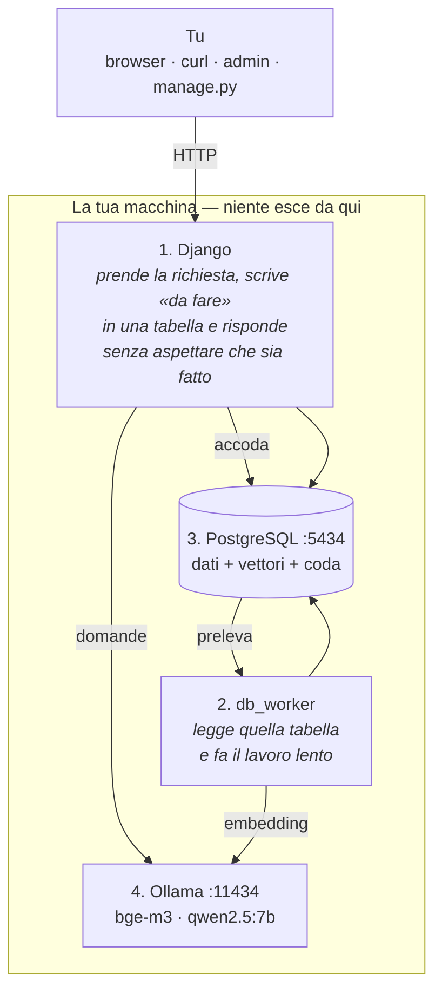
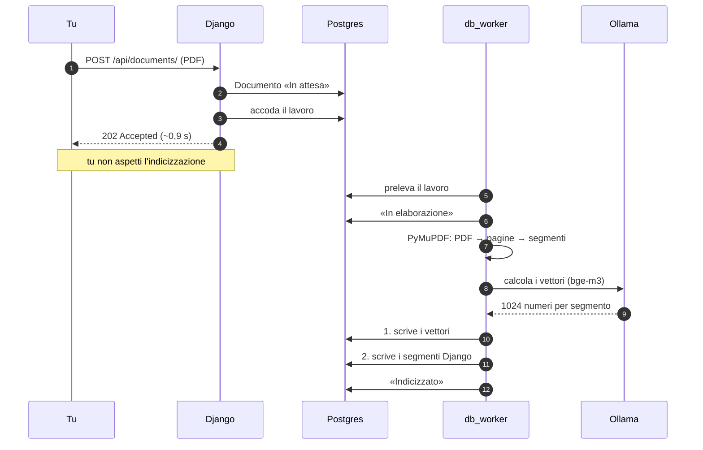
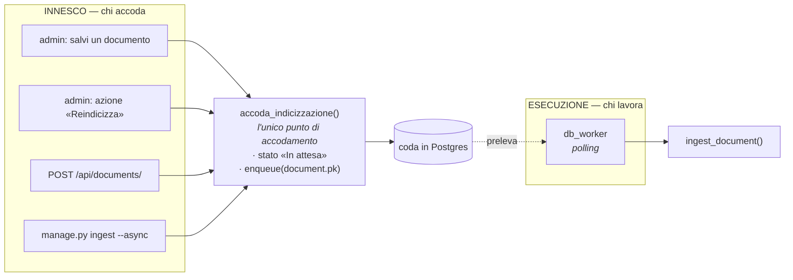
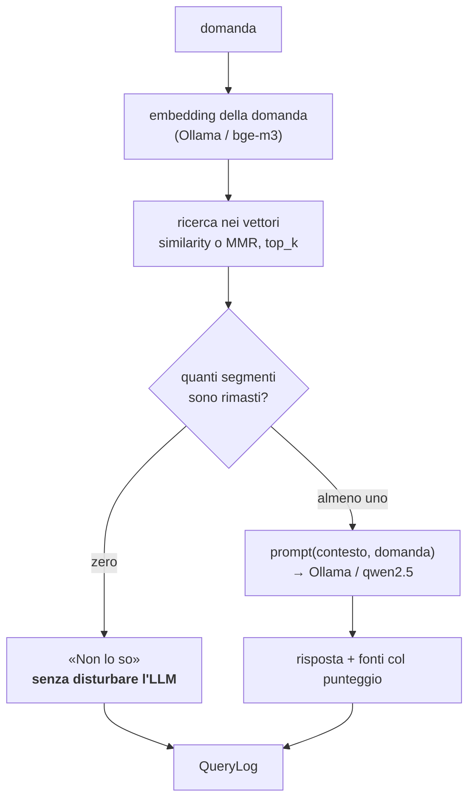
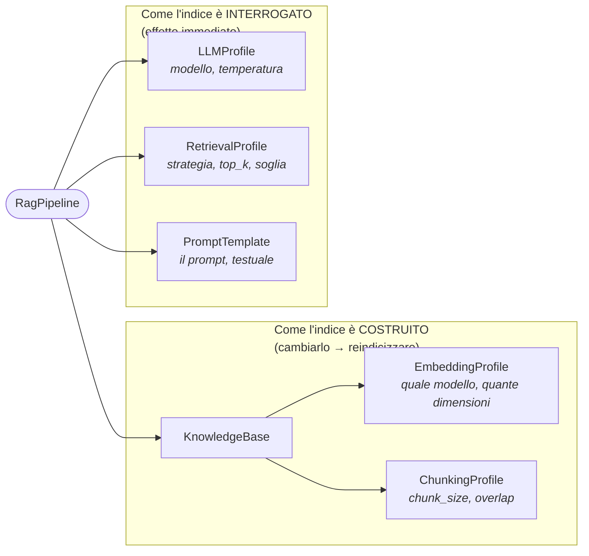
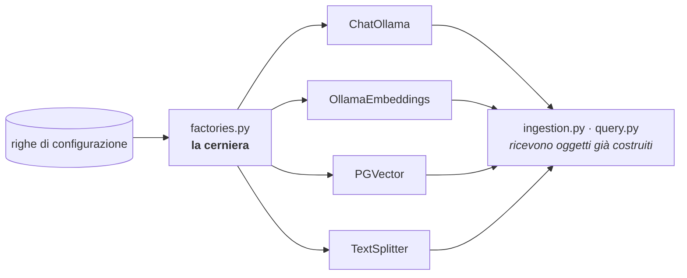
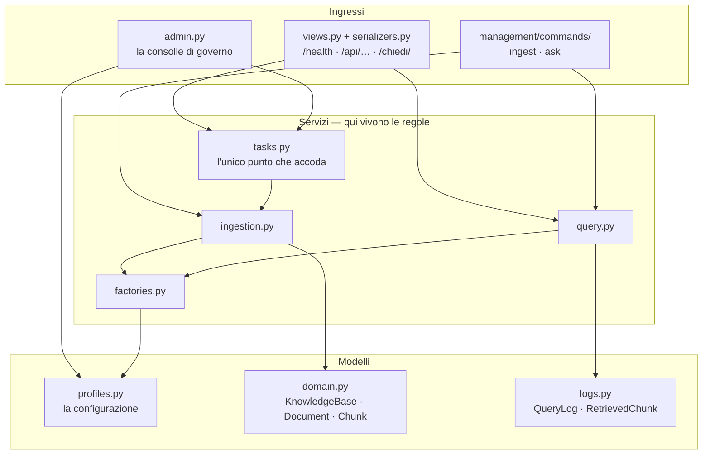
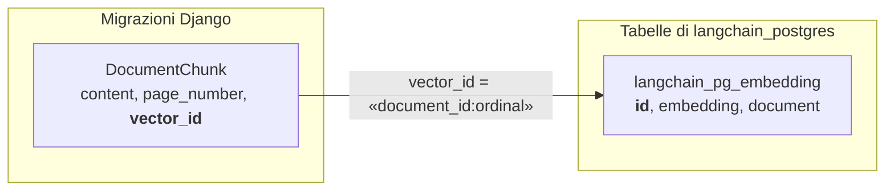
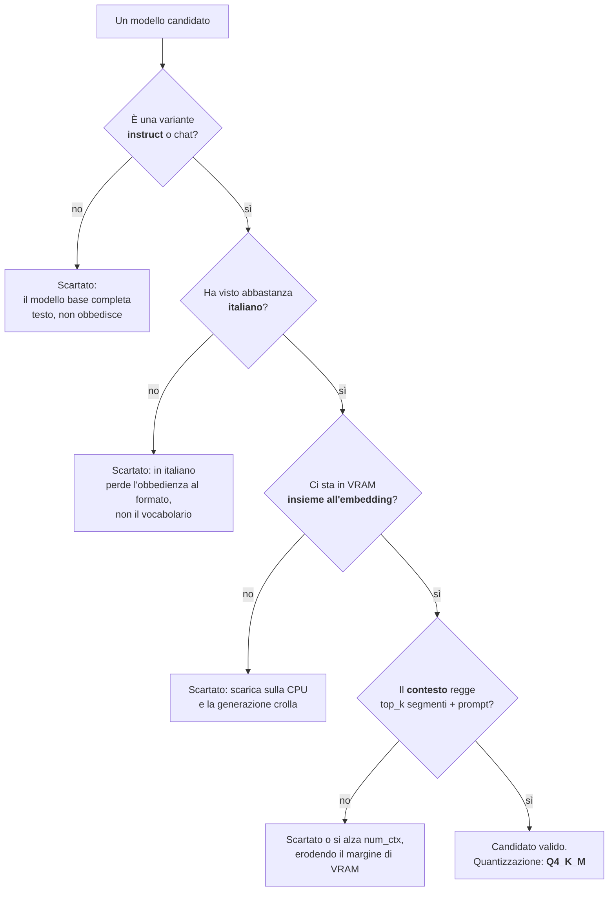

# Architettura in breve

Panoramica per chi apre il progetto la prima volta. La versione completa —
alternative valutate, misure, limiti dichiarati — è in
[ARCHITECTURE.md](ARCHITECTURE.md); qui non si trova nulla che là non ci sia già,
solo detto in meno parole.

**Non serve leggerlo tutto.**

| Sezioni | Cosa ci trovi | Quando servono |
|---|---|---|
| **§1–§2** | Cosa fa il sistema e di quali pezzi è fatto | sempre: sono i primi cinque minuti |
| **§3–§4** | I due flussi: carico un PDF, faccio una domanda | sempre |
| **§5–§7** | La configurazione come tabella, la mappa dei file, le due metà del database | prima di mettere mano al codice |
| **§8–§9** | Le dieci scelte e i due modelli, con le alternative scartate | quando serve rispondere a un «perché non…?» |
| **§10–§11** | I limiti dichiarati, e le tre cose da ricordare | prima di fidarsi del sistema |

---

## 1. Cosa fa, in una frase

Carichi dei PDF, il sistema li spezza in segmenti e li trasforma in vettori;
poi fai una domanda, il sistema recupera i segmenti più pertinenti e li dà a un
LLM che risponde **citando le fonti**.

Due caratteristiche lo distinguono da un RAG qualsiasi:

- **nulla esce dalla macchina** — generazione ed embedding girano su Ollama in
  locale (RNF-01, verificato a rete staccata);
- **nessun parametro di comportamento sta nel codice** — modello, temperatura,
  dimensione dei segmenti, strategia di recupero, prompt: sono righe di
  database, modificabili dall'admin (RF-22).

---

## 2. I pezzi in gioco



| | Cos'è | Dove gira |
|---|---|---|
| **1. Django** | Il server: API REST, admin, `/health`, pagina `/chiedi/` | processo locale |
| **2. `db_worker`** | Secondo processo: fa il lavoro lento (indicizzare) | processo locale |
| **3. PostgreSQL** | L'**unico** servizio con stato: dati, vettori, coda | Docker, porta 5434 |
| **4. Ollama** | L'inferenza: embedding *e* generazione | nativo sull'host |

Niente Redis, niente Celery, niente servizi cloud. La coda vive dentro Postgres.

**«Accodare» e «rispondere subito», in concreto.** Indicizzare un PDF è lento —
misurati 12,4 s a freddo e 2,7 s a caldo su un PDF di 4 pagine, quasi tutti spesi
a chiamare Ollama. Django non lo fa: scrive in Postgres una riga che dice «c'è il
documento 37 da indicizzare» (un `INSERT`, millisecondi) e risponde **202
Accepted**, che in HTTP significa *«ho preso in carico, non ho ancora finito»*.
È lo sportello che ti dà un numerino invece di farti stare in piedi allo
sportello: da lì in poi controlli l'avanzamento con `GET /api/documents/{id}/`.

| | Chi aspettava | Risposta |
|---|---|---|
| Fino a P4, in linea | **tu**, 14,53 s a freddo | 201 Created |
| Da P5, in coda | **il worker**, 12,4 s a freddo | 202 Accepted in 0,9 s |

Il lavoro non è sparito e non è diventato più veloce: si è spostato su qualcuno
che non ti fa aspettare.

> **Il modo più probabile di sbagliare l'avvio:** dimenticare il worker. Senza,
> i documenti restano «In attesa» per sempre — non è un guasto, e `/health` lo
> dichiara sotto la voce «coda».

---

## 3. Flusso A — carico un PDF



### Innesco ≠ esecuzione

**`manage.py db_worker` non fa partire il flusso A: lo esegue.** È un
consumatore passivo — fa polling sulla tabella dei task e lavora ciò che trova.
A far partire il flusso è sempre qualcun altro, e gli inneschi sono quattro:



I quattro inneschi passano **tutti** da `accoda_indicizzazione()`: se ognuno
scrivesse per conto proprio stato ed `enqueue`, la prima modifica a quella
coppia di righe si dimenticherebbe in tre punti su quattro.

Le due metà si guastano in modo diverso, e conviene saperlo prima:

| Situazione | Cosa succede |
|---|---|
| Accodi **senza** worker acceso | Il documento resta «In attesa» a tempo indeterminato. Nessun errore: `/health` lo dichiara sotto la voce «coda» |
| Worker acceso e **nessuno** accoda | Non succede nulla. Il worker sta lì e basta |

**L'unica eccezione:** `manage.py ingest` **senza** `--async` esegue tutto il
flusso A nel proprio processo, worker o non worker. È voluto — RNF-03 parla del
ciclo richiesta/risposta HTTP, di cui un comando di gestione non fa parte, e le
prove di consegna devono poter girare con un processo solo.

```powershell
manage.py ingest file.pdf            # sincrono, nessun worker coinvolto
manage.py ingest file.pdf --async    # accoda soltanto, serve il worker
```

### L'ordine delle scritture

**L'ordine dei passi 1 e 2 non è casuale.** Le due metà stanno su connessioni
diverse e nessuna transazione le comprende entrambe. Nel verso scelto, se cade
la seconda metà restano al più *vettori orfani*: invisibili e sovrascritti dalla
prossima esecuzione. Nel verso opposto resterebbero segmenti che puntano a
vettori inesistenti — un indice che mente, in silenzio e per sempre.

Un fallimento non sparisce nei log: il documento passa a «Fallito» con il motivo
scritto sopra, leggibile nell'admin.

---

## 4. Flusso B — faccio una domanda



Tre cose che il diagramma non dice:

- **il recupero sta fuori dalla catena LCEL**, prima di essa, perché il log
  vuole `retrieval_ms` e `generation_ms` separati;
- **il `QueryLog` si scrive sempre**, anche quando l'interrogazione fallisce;
- **il punteggio che circola è la rilevanza** (`1 − distanza`, più alto = più
  pertinente). La distanza grezza di pgvector viene convertita in un punto solo
  e non esce mai da lì.

---

## 5. L'idea portante: la configurazione è una tabella

Ogni parametro di comportamento è una riga di database. I profili si compongono
in una **pipeline**, e cambiare pipeline significa cambiare una tendina — non
una riga di codice, non un riavvio.



La divisione in due famiglie non è estetica: cambiare `chunk_size` **non** ha
effetto sui documenti già indicizzati, cambiare `top_k` ce l'ha sulla domanda
successiva. Mettere il chunking sulla pipeline farebbe mostrare all'admin un
parametro che mente.

Il punto in cui quelle righe diventano oggetti LangChain è **uno solo**:



---

## 6. Dove sta cosa



| File | Ruolo in una riga |
|---|---|
| `rag/models/profiles.py` | I sei profili: **la configurazione è qui** |
| `rag/models/domain.py` | `KnowledgeBase`, `Document`, `DocumentChunk` |
| `rag/models/logs.py` | `QueryLog`, `RetrievedChunk`: cosa è successo |
| `rag/services/factories.py` | La cerniera: configurazione → oggetti LangChain |
| `rag/services/ingestion.py` | Flusso A |
| `rag/services/query.py` | Flusso B |
| `rag/tasks.py` | L'unico punto che accoda lavoro al worker |
| `rag/views.py` | Guscio HTTP, nessuna regola di dominio |
| `rag/admin.py` | La consolle di governo — è il punto della traccia |

---

## 7. Il database ha due proprietari



Le tabelle `langchain_pg_*` sono create e gestite da `PGVector`: Django non le
conosce e **non deve migrarle**. Il ponte è `DocumentChunk.vector_id`, che è
*deterministico* — ed è ciò che rende la reindicizzazione idempotente e la
cancellazione dei vettori possibile anche a righe Django già sparite.

Il testo di ogni segmento esiste quindi **due volte**, in `DocumentChunk.content`
e in `langchain_pg_embedding.document`. È ridondanza accettata di proposito: è il
prezzo per poter ispezionare e citare i segmenti con l'ORM normale, nell'admin.

---

## 8. Le scelte, e cosa costano

Dieci decisioni, ciascuna con le alternative che sono state valutate e scartate.
Prima il quadro d'insieme, poi il confronto opzione per opzione **nello stesso
ordine**, che è quello del sistema: si ingerisce (8.1–8.3), si conserva
(8.4–8.5), si interroga (8.6–8.7), si governa (8.8–8.10). Il dettaglio esteso —
misure sul campo, versioni verificate, piani di ripiego — resta in
`ARCHITECTURE.md` §7, indicato nell'ultima colonna.

### Il quadro d'insieme

| Decisione | Scelto | Perché | Il prezzo |
|---|---|---|---|
| **8.1 · Come si estrae il testo** | **PyMuPDF diretto** | ~10 righe di codice e **zero dipendenze aggiuntive** | Il loader è nostro, quindi da testare noi. Il `PyMuPDFLoader` di LangChain avrebbe trascinato sei pacchetti per dieci righe (§7.10) |
| **8.2 · Come si tagliano i PDF** | **Recursive character** | Rispetta i confini di paragrafo e frase, nessuna dipendenza in più | Ignora la struttura del documento: tabelle e testo a colonne vengono tagliati male (§7.4) |
| **8.3 · Chi calcola gli embedding** | **`bge-m3` su Ollama** | Ottimo multilingua (i PDF sono in italiano) e soprattutto **stesso servizio dell'LLM**: il progetto resta libero da torch, ~2,5 GB di dipendenze risparmiati | 1024 dimensioni = indice più pesante; ~1,2 GB di VRAM condivisi con il modello che genera (§7.3) |
| **8.4 · Dove stanno i vettori** | **pgvector** | Un solo datastore da avviare e da salvare; filtri sui metadata in SQL | Su milioni di vettori un motore dedicato sarebbe più veloce (§7.2) |
| **8.5 · Come si accede ai vettori** | **`langchain_postgres.PGVector`** | Similarity, MMR e soglia già pronti: la traccia premia la configurabilità del recupero | **Due ORM e due driver** verso lo stesso database, due tabelle fuori dalle migrazioni, testo duplicato. Libreria ferma alla 0.0.17 (§7.9) |
| **8.6 · Come si recupera** | **Similarity** (default), **MMR** e **soglia** disponibili | Baseline prevedibile, con due alternative selezionabili dall'admin | Niente ricerca ibrida BM25 né reranker: sarebbero meglio su sigle e nomi propri, ma sono fuori scope (§7.7) |
| **8.7 · Chi genera** | **Ollama** | Si installa con un comando, gestisce i modelli da sé, cambiare modello = cambiare una stringa nell'admin | Più lento di vLLM, batching limitato, non pensato per molte richieste insieme (§7.1) |
| **8.8 · Come si lavora in background** | **`django-tasks` + backend DB** | La coda vive in Postgres: nessun servizio in più. E l'API è agnostica — passare a Celery sarebbe una riga di `settings.TASKS` | Il worker fa polling (latenza di partenza ~1 s); due pacchetti e 19 migrazioni in più (§7.5) |
| **8.9 · Dove vive la configurazione** | **Modelli Django** | Admin nativo, validazione, relazioni, storico nelle migrazioni | Più codice iniziale di una libreria di flag (§7.6) |
| **8.10 · Come si osserva** | **`QueryLog` nell'admin** | Zero infrastruttura, e sta dove la traccia chiede che il sistema sia governabile | Nessun tracing per singolo passo, nessun conteggio dei token, UI spartana. Langfuse costerebbe **sei container** (§7.8) |

Nelle tabelle che seguono **✅ segna l'opzione adottata**.

### Ingestione — dal PDF ai vettori

#### 8.1 Come si estrae il testo dal PDF

| Opzione | Pro | Contro |
|---|---|---|
| **PyMuPDF diretto** ✅ | ~10 righe per produrre documenti col numero di pagina nei metadata; controllo totale sul rilevamento del PDF senza testo; **zero dipendenze aggiuntive** | Il codice del loader è nostro, quindi da testare noi |
| `PyMuPDFLoader` di LangChain | Poche righe in meno, metadata già popolati | Trascina `langchain-community` e con essa `aiohttp`, `requests`, `pydantic-settings`, `tenacity`: **sei pacchetti per dieci righe** |

**Scelto perché:** proporzione fra beneficio e peso, e nient'altro — il loader di LangChain funzionerebbe benissimo.

#### 8.2 Come si tagliano i PDF

| Opzione | Pro | Contro |
|---|---|---|
| **Recursive character** ✅ | Rispetta i confini di paragrafo e frase; nessuna dipendenza extra | Ignora la struttura del documento: tabelle e testo a colonne vengono tagliati male |
| Basato su token | Allineato alla finestra di contesto, dimensioni prevedibili | Richiede un tokenizer coerente col modello. **Esposto nell'admin ma rifiutato**: `tiktoken` implementa i BPE di OpenAI, e misurare con quello i segmenti di `qwen2.5` darebbe un conteggio plausibile e falso |
| Semantic chunking | Segmenti coerenti per significato | Costo di embedding all'ingestione molto più alto — e il guadagno **non è confermato** (sotto) |
| Layout-aware (`unstructured`) | Gestisce tabelle e layout multicolonna | Dipendenze pesanti (OCR, poppler), ingestione lenta |

**Scelto perché:** su prosa documentale è la baseline che regge, e il taglio cieco a lunghezza fissa resta l'*ultima* risorsa dello splitter, non la prima.

**L'evidenza pubblicata.** Il semantic chunking non è nell'enum: è stato valutato
e lasciato fuori, con un argomento di proporzione fra costo e beneficio. Dal 2025
quel guadagno è stato misurato da altri:

| Fonte | Esito |
|---|---|
| Qu, Tu, Bao, *Is Semantic Chunking Worth the Computational Cost?*, Findings NAACL 2025 | Su tre compiti di recupero e generazione, i costi del semantic chunking **non sono giustificati da guadagni consistenti** |
| Benchmark Vecta/FloTorch, febbraio 2026 — 7 strategie su 50 articoli | Ricorsivo a 512 token **primo (~69%)**, semantic ~54%: i frammenti troppo corti recuperano bene ma lasciano all'LLM troppo poco contesto |
| **Contro-evidenza**, MDPI *Bioengineering*, novembre 2025 | Su documentazione clinica il chunking **adattivo** arriva all'87% contro il 50% del **fixed-size** |

La terza riga non contraddice le prime due, ed è la distinzione che conta: lì il
confronto è contro il **taglio a lunghezza fissa**, che ignora i confini del
testo. Il ricorsivo non è quello — rispetta paragrafi e frasi *prima* di tagliare
a misura, quindi è già segmentazione consapevole dei confini, in versione
economica.

La conclusione difendibile è **«dipende dal dominio; per prosa documentale, il
ricorsivo»**. Il dettaglio delle fonti, con le riserve su quali sono state
verificate su fonte primaria e quali no, è in `ARCHITECTURE.md` §7.4.

#### 8.3 Chi calcola gli embedding

| Opzione | Pro | Contro |
|---|---|---|
| **`bge-m3` via Ollama** ✅ | Multilingua di prima fascia (i PDF sono in italiano); **stesso servizio dell'LLM**, quindi nessuna dipendenza da torch (~2,5 GB risparmiati); nessun caricamento dentro il processo web | 1024 dimensioni: indice più pesante; ~1,2 GB di VRAM condivisi col modello che genera |
| `multilingual-e5-small` (HuggingFace) | Buon multilingua, 384 dimensioni = indice compatto | Gira **in-process** via sentence-transformers: torch fra le dipendenze, memoria duplicata per ogni worker |
| `nomic-embed-text` via Ollama | Stesso servizio dell'LLM, 768 dimensioni | Prevalentemente inglese: degraderebbe il recupero su documenti italiani |
| Embedding cloud (OpenAI, Cohere) | Qualità superiore, nessun costo computazionale locale | Il testo dei documenti uscirebbe dal perimetro. **Contraddice il requisito** |

**Scelto perché:** non per qualità pura — `e5-small` era adeguato — ma perché passare da Ollama tiene l'intero progetto libero da torch e concentra l'inferenza in un servizio solo.

### Persistenza — dove i vettori finiscono, e chi li interroga

#### 8.4 Dove stanno i vettori

| Opzione | Pro | Contro |
|---|---|---|
| **pgvector** ✅ | Un solo datastore da avviare e da salvare; filtri sui metadata in SQL; un solo backup | Dimensione del vettore fissata nello schema; su milioni di vettori un motore dedicato è più veloce |
| Chroma | Zero infrastruttura, ideale per prototipi | Persistenza separata dal database → rischio di disallineamento; meno maturo |
| FAISS | Ricerca velocissima | In memoria: nessuna persistenza dei metadata, nessun filtro, reindicizzazione a ogni avvio |
| Qdrant | Filtri potenti, prodotto eccellente | Un servizio in più senza un vantaggio concreto a questa scala |

**Scelto perché:** il criterio vero è stato *quanti servizi deve avviare chi valuta il progetto*. Con pgvector, uno.

#### 8.5 Come si accede ai vettori

Scelto pgvector, resta una seconda decisione che spesso si dà per scontata: **chi
scrive le query vettoriali**.

| Opzione | Pro | Contro |
|---|---|---|
| **`langchain_postgres.PGVector`** ✅ | Similarity, MMR e soglia già pronti; integrazione diretta con LangChain; nessuna query SQL scritta a mano | Possiede due tabelle fuori dalle migrazioni Django; impone la duplicazione del testo; ferma alla **0.0.17**; trascina SQLAlchemy e un secondo driver — **due ORM verso lo stesso database** |
| Retriever proprio sull'ORM di Django | **Uno schema solo**, tutto sotto migrazioni; nessuna duplicazione del testo; un solo ORM e un solo driver | MMR, `fetch_k` e `score_threshold` da realizzare a mano; più codice da testare |

**Scelto perché:** la traccia premia la configurabilità del *recupero*, e avere MMR e soglia già pronti vale più dell'eleganza dello schema. Il piano di ripiego è dichiarato: il retriever proprio costa circa mezza giornata e degrada il solo MMR.

### Interrogazione — dalla domanda alla risposta

#### 8.6 Come si recupera

| Opzione | Pro | Contro |
|---|---|---|
| **Similarity** ✅ *(predefinita)* | Baseline solida e prevedibile | Può restituire segmenti quasi identici |
| **MMR** ✅ *(selezionabile)* | Diversifica i risultati, utile su PDF ripetitivi | Due parametri in più da tarare (`fetch_k`, `lambda_mult`) |
| **Similarity + soglia** ✅ *(selezionabile)* | È l'unico ramo in cui `score_threshold` filtra davvero | Il filtro agisce **dopo** il `top_k`: con `top_k=4` e soglia alta si possono avere zero risultati |
| Ibrido BM25 + vettoriale | Molto meglio su codici, sigle, nomi propri | Richiede un indice full-text parallelo. **Fuori ambito** |
| Reranker cross-encoder | Miglioramento netto della precisione | Raddoppia la latenza, un modello in più da servire. **Fuori ambito** |

**Scelto perché:** tre strategie realizzate e selezionabili dall'admin coprono il confronto che la traccia chiede di poter fare. La soglia predefinita **0,5** non è a occhio: cade nell'intervallo vuoto fra le rilevanze misurate sul corpus di prova (0,68–0,73 pertinenti; 0,15–0,26 fuori tema).

#### 8.7 Chi genera le risposte

| Opzione | Pro | Contro |
|---|---|---|
| **Ollama** ✅ | Installazione in un comando; gestione dei modelli integrata; cambiare modello = cambiare una stringa nell'admin | Overhead superiore a vLLM; batching limitato; non pensato per alta concorrenza |
| vLLM | Throughput elevato, *continuous batching*, API compatibile OpenAI | Configurazione CUDA delicata, immagine pesante; sovradimensionato per una prova |
| llama.cpp / llama-server | Leggerissimo, ottimo su CPU, modelli GGUF quantizzati | Gestione dei modelli manuale, integrazione meno curata |
| `transformers` in-process | Nessun servizio esterno da avviare | Il modello vive **dentro** il processo Django: memoria enorme, ricaricamento lentissimo, incompatibile con più worker |
| LM Studio | Ottima interfaccia grafica | Non scriptabile né containerizzabile |

**Scelto perché:** è l'unico che rende il modello un *parametro*. Cambiarlo dall'admin senza toccare il codice è il requisito centrale della traccia, e con Ollama costa una stringa.

### Impianto — come il sistema si governa

#### 8.8 Come si lavora in background

| Opzione | Pro | Contro |
|---|---|---|
| **`django-tasks` + backend database** ✅ | API **agnostica rispetto al backend**, identica a quella entrata nella stdlib con Django 6; la coda vive in Postgres, nessun servizio in più | Il worker fa polling; niente retry ricchi nell'API; **due** pacchetti e 19 migrazioni in più |
| Celery + Redis | Standard di fatto, retry, monitoraggio maturo | Un servizio con stato in più: **Postgres non è un broker supportato**, quindi Redis diventa obbligatorio |
| procrastinate | Nativo Postgres con `LISTEN/NOTIFY`: nessun polling, locking solido | Meno diffuso, API propria non agnostica |
| django-q2 | Usa l'ORM come broker, semplice | Ecosistema più piccolo, superato in prospettiva da `django.tasks` |
| Sincrono nella richiesta | Semplicissimo | Timeout HTTP su PDF di centinaia di pagine |
| `threading.Thread` | Nessuna dipendenza | Nessuna durabilità: un riavvio perde il lavoro |

**Scelto perché:** il vantaggio decisivo non è risparmiare un container, ma che l'API è disaccoppiata dalla coda — passare a Celery sarebbe una riga di `settings.TASKS`, non una riscrittura. È la tesi del progetto (il comportamento è configurazione) estesa alle code.

#### 8.9 Dove vive la configurazione

| Opzione | Pro | Contro |
|---|---|---|
| **Modelli Django** ✅ | Admin nativo, validazione in `clean()`, relazioni, storico via migrazioni | Più codice iniziale |
| django-constance | Rapidissimo per flag globali | Coppie chiave/valore piatte: niente profili multipli, niente relazioni |
| `settings.py` o variabili d'ambiente | Semplice, versionato | Richiede riavvio e accesso al codice. **Contraddice il requisito** |
| Un unico `JSONField` | Massima flessibilità | Nessuna validazione, nessuna interfaccia decente |

**Scelto perché:** è l'unica opzione in cui «più configurazioni complete che coesistono e si confrontano» (RF-23) è una cosa che lo schema sa esprimere.

#### 8.10 Come si osserva il sistema

| Opzione | Pro | Contro |
|---|---|---|
| **`QueryLog` + `RetrievedChunk` nativi** ✅ | Zero infrastruttura; visibili **nell'admin**, cioè dove la traccia chiede che il sistema sia governabile; interrogabili con l'ORM | Nessun tracing per singolo passo; nessun conteggio dei token; interfaccia spartana |
| Langfuse self-hosted | Tracing per passo, conteggio token, valutazioni; interamente installabile nel perimetro | **Sei container**, minimo raccomandato 4 vCPU e 8 GB di RAM — accanto a un modello 7B su GPU |
| Langfuse cloud | Nessuna infrastruttura da gestire | Le tracce contengono il prompt completo, quindi i segmenti estratti dai PDF: **contraddice la premessa** |
| Arize Phoenix | Container singolo, valutazioni RAG native | Un servizio comunque in più |
| OpenTelemetry puro | Leggerissimo, esporta verso qualunque backend | Richiede un backend di raccolta per essere utile |

**Scelto perché:** l'osservabilità doveva stare dove sta il governo del sistema. Resta un punto di aggancio per Langfuse dietro un flag, spento di default — e anche acceso, la sua gestione dei prompt resterebbe **inutilizzata**: i prompt devono vivere in `PromptTemplate`, o si svuota il requisito centrale.

### Le tre scelte che sorprendono

**1. Alcune opzioni esistono nell'admin ma si rifiutano di funzionare.** Negli
enum trovi `openai_compatible`, `huggingface`, `token`-based splitter: sono
**alternative documentate, non opzioni attivabili**. Sceglierle solleva
`ConfigurazioneNonSupportata` con un messaggio che spiega il perché — i primi due
manderebbero il testo dei documenti fuori dalla macchina, il terzo misurerebbe i
segmenti col tokenizer di un altro modello, producendo un conteggio plausibile e
falso. Un rifiuto esplicito vale più di un valore silenziosamente ignorato.

**2. Il recupero non usa `as_retriever()`**, che sarebbe la via ovvia. Un
retriever restituisce i documenti **senza i punteggi**, e i punteggi servono: le
fonti mostrate all'utente li portano, e `RetrievedChunk.score` non è nullable. La
via alternativa — un retriever per il contesto più una seconda ricerca per le
fonti — costerebbe due volte l'embedding della domanda (~1,2 s buttati) e
rischierebbe di mostrare fonti **diverse** dai segmenti davvero passati all'LLM.
Una citazione che non corrisponde al contesto è peggio di nessuna citazione.

**3. `manage.py ingest` è rimasto sincrono**, mentre tutto il resto è passato in
coda. Non è una dimenticanza: RNF-03 parla del ciclo richiesta/risposta HTTP, di
cui un comando di gestione non fa parte, e le prove di consegna devono poter
girare con un processo solo.

---

## 9. Perché proprio questi due modelli

La riga «`bge-m3` su Ollama» e quella «Ollama» del §8 nascondono la domanda che
in demo arriva sempre: *perché 7 miliardi di parametri e non 3, o 14?*

### Il vincolo che decide davvero: 8 GB di VRAM

La dimensione del modello non è una preferenza, è **aritmetica**. Un modello
occupa in VRAM all'incirca `parametri × bit per parametro / 8`, più la cache del
contesto — e qui i modelli caricati sono **due**, perché anche l'embedding sta
sulla stessa scheda.

| Modello che genera | A Q4_K_M | Ci sta **insieme a `bge-m3`** (664 MB)? |
|---|---|---|
| 3B | ~2,0 GB | Sì, con abbondanza |
| **7B** ✅ | **4,68 GB** (misurato in P0) | **Sì: 5,4 GB in due, restano ~2,6 GB per la cache del contesto** |
| 14B | ~9 GB | **No.** Sfora da solo, prima ancora dell'embedding |
| 32B | ~20 GB | Nemmeno da vicino |

Quindi **7B non è stato scelto fra tutti: è il più grande che ci stava** lasciando
spazio al secondo modello.

> **Il modo silenzioso di sbagliare.** Quando un modello non ci sta, Ollama non
> si rifiuta: ne scarica una parte sulla CPU e la generazione passa da ~1 s a
> decine di secondi. Non è un errore, è un degrado che non si annuncia. Il
> margine è stretto e il progetto l'ha visto: in P0 il recupero è costato ~12 s
> sulle prime domande perché `bge-m3` veniva **ricaricato**, avendogli `qwen2.5`
> preso la VRAM nel frattempo.

### Come si sceglie il modello che genera

L'equivoco più comune è cercare un modello che *sappia* le cose. In RAG i fatti
glieli metti tu nel prompt: quello che serve è un modello che **obbedisca**.



Le tre cose che gli chiedi davvero, e che dipendono dall'**addestramento a
istruzioni**, non dal numero di parametri:

| | Perché conta qui |
|---|---|
| **Seguire istruzioni** | Il prompt di sistema dice «rispondi solo da questo contesto». Chi lo ignora inventa |
| **Restare fedele al contesto** | Deve preferire ciò che legge a ciò che «ricorda» dall'addestramento |
| **Saper dire «non lo so»** | È letteralmente CA-4. Molti modelli piccoli preferiscono una risposta plausibile |

È per questo che si usa `qwen2.5:7b-`**`instruct`** e non `qwen2.5:7b`.

**Sulla quantizzazione:** Q4_K_M è il punto di equilibrio. Sotto (Q3, Q2) il
danno si vede per primo proprio sull'obbedienza alle istruzioni e sulle lingue
diverse dall'inglese — cioè esattamente ciò che serve. Sopra (Q8, fp16) si paga
il doppio o il quadruplo di VRAM per un guadagno che su questo compito non si
misura.

### L'embedding si sceglie con criteri **diversi**

Un modello di embedding non è un LLM piccolo: è addestrato con un obiettivo
**contrastivo** — «avvicina la domanda al passaggio che la risponde, allontanala
da tutti gli altri». Un LLM grande produce embedding mediocri, perché nessuno
gliel'ha mai chiesto.

| Criterio | Cosa ha deciso per `bge-m3` |
|---|---|
| **Multilingua** | Decisivo: domanda e documenti in italiano. `nomic-embed-text` è prevalentemente inglese, e degraderebbe il recupero — scartato per questo |
| **Addestrato per il recupero** | Non un modello di linguaggio riadattato |
| **Dimensioni del vettore** | 1024 contro i 384 di `e5-small`: indice più pesante, guadagno reale ma modesto |
| **Lunghezza massima gestita** | 8192 token: il `chunk_size` non è vincolato dal modello |
| **Prefissi richiesti** | Alcuni (`e5`) pretendono `query:` / `passage:` davanti al testo, e sbagliarli degrada il recupero **in silenzio**. `bge-m3` non li richiede |

Il fattore che ha davvero deciso, però, non è la qualità: passare da Ollama tiene
il progetto **libero da torch** (~2,5 GB di dipendenze) e concentra l'inferenza
in un servizio solo, governabile dall'admin.

### Perché alcuni funzionano meglio di altri

In ordine di quanto pesa davvero:

1. **La miscela dei dati di addestramento** — quanto italiano ha visto, e quanto
   testo procedurale;
2. **La qualità dell'allineamento a istruzioni** — è ciò che separa un modello
   che dice «non lo so» da uno che inventa. Due modelli da 7B possono comportarsi
   in modo opposto su questo;
3. **Il danno della quantizzazione** — un 14B a Q2 spesso è peggio di un 7B a Q4,
   a parità di memoria occupata;
4. **Il numero di parametri**, che conta **meno di quanto si creda su questo
   compito**: il salto 3B → 7B si sente, quello 7B → 14B si sente sul
   *ragionamento*, e il RAG estrattivo ne richiede poco — la risposta è quasi
   sempre già scritta nel contesto.

Detto brutalmente: **su un compito RAG la qualità la decide il recupero molto più
del modello che genera.** Se i segmenti giusti non arrivano nel prompt nessun
modello li indovina; se arrivano, anche un 7B risponde bene.

### Il limite di questa sezione

**Nessun confronto testa a testa è stato fatto.** Non esistono misure di
`qwen2.5:7b` contro `llama3.1:8b` sullo stesso corpus, per la stessa ragione per
cui il progetto non ha una valutazione quantitativa della qualità: senza un
dataset di riferimento sarebbe un numero senza significato. Quello che è misurato
sono le bande di rilevanza del recupero e la correttezza delle risposte ottenute
— abbastanza per dire che la configurazione funziona, non abbastanza per dire che
è la migliore.

Ed è il punto in cui l'architettura risponde da sé: **il modello è un campo
dell'admin.** Provare `llama3.1:8b` costa un `ollama pull` e una stringa cambiata
in `LLMProfile.model_name` — nessun riavvio, nessuna modifica al codice.

---

## 10. I limiti, pezzo per pezzo

Nessuno di questi è un difetto scoperto dopo: sono conseguenze note delle scelte
del §8, dichiarate perché chi ci mette mano non le riscopra per caso.

### Cosa il sistema non sa fare

| Limite | Conseguenza concreta |
|---|---|
| **Niente OCR** | Un PDF di sole immagini (scansione) produce zero segmenti. Il caso è **rilevato** e segnalato come errore esplicito, non lasciato passare come documento vuoto |
| **Niente memoria conversazionale** | Ogni domanda è indipendente: «e quanti sono in totale?» non ha modo di sapere a cosa si riferisce |
| **Niente permessi sui documenti** | Ogni utente autenticato vede l'intera base di conoscenza |
| **Niente valutazione della qualità** | Nessun punteggio RAGAS o simili: senza un dataset di riferimento sarebbe un numero senza significato. I `QueryLog` conservano però la materia prima per costruirla |
| **Niente streaming** | La risposta arriva tutta insieme a generazione finita, non parola per parola |

### Cosa costa in tempo

| Dove | Quanto | Perché |
|---|---|---|
| Prima ingestione di un worker appena avviato | **12,4 s** contro 2,7 s a caldo | Il modello di embedding si carica una volta per processo. Un worker riavviato ripaga quel costo |
| Partenza di un lavoro in coda | ~1 s | Il worker fa polling, non viene svegliato |
| Costruzione del `PGVector` | 0,83 s | La libreria esegue DDL a **ogni** costruzione. Per questo l'oggetto si costruisce una volta per ingestione, **mai dentro un ciclo**, ed è memorizzato per processo |

### Dove il sistema può guastarsi, e come

| Situazione | Cosa succede | Come si rimedia |
|---|---|---|
| Worker spento | I documenti restano «In attesa» a tempo indeterminato, **senza errori** | Avviare `db_worker`. `/health` lo segnala |
| Un task fallisce | **Nessun ritentativo automatico** | Azione «Reindicizza» nell'admin, che esiste già |
| Stesso documento accodato due volte | **Nessun lucchetto**: due esecuzioni parallele sprecano lavoro | Non serve rimediare: gli id dei vettori sono deterministici e l'upsert li sovrascrive, quindi si perde tempo, mai correttezza |
| Cade la seconda metà di una scrittura | Restano **vettori orfani** | Si ripara da solo: la prossima indicizzazione li sovrascrive |
| Cancelli un documento | I vettori spariscono, **il PDF resta in `media/`** | Comportamento predefinito di Django, dichiarato e non nascosto |
| Sposti un documento in un'altra base | Non è permesso dall'admin | E deve restare così: i vettori resterebbero nella collezione di partenza e il documento diventerebbe invisibile *in silenzio* |

### Il limite che si legge al contrario di com'è

**Nella pipeline predefinita `score_threshold` non filtra nulla.** Il profilo
predefinito ha `score_threshold = 0.5`, ma il confronto con la soglia avviene
**solo** nella strategia `similarity_score_threshold` — e la pipeline predefinita
usa `similarity`. Misurato: su una domanda fuori tema tornano 3 segmenti con
rilevanza 0,2192 / 0,1946 / 0,1659, e a dichiarare la non conoscenza è il
**prompt di sistema**, non il filtro.

Il filtro esiste, funziona ed è coperto da un test — ma si attiva **scegliendo
quella strategia dall'admin**. La differenza non è accademica: il filtro è una
garanzia del codice, il prompt dipende dall'obbedienza del modello.

### Il limite della garanzia «nulla esce»

RNF-01 è **verificato**, non solo argomentato: il 26/07/2026 il ciclo completo
ha funzionato a interfacce di rete disattivate, con gli stessi tempi, e tutte e
dodici le richieste HTTP dei due processi sono andate a `localhost:11434`.

Tre cose restano però **fuori** da quella garanzia:

1. **`LLMProfile.base_url` è modificabile dall'admin.** Un amministratore può
   puntare l'inferenza a un host qualunque e far uscire i segmenti. È il varco
   vero — la configurabilità che la traccia chiede *è* anche la superficie di
   rischio. In produzione servirebbe una lista di host ammessi;
2. **nessuna misura verso chi ha accesso al database:** i segmenti sono in
   chiaro e il PDF originale sta in `media/`;
3. **nessun isolamento di rete a livello di container:** la garanzia è di
   *configurazione*, non imposta dall'infrastruttura.

### Fuori scope, dichiarato

Reranking, ricerca ibrida, streaming SSE, memoria conversazionale,
multi-tenancy, permessi per segmento, OCR.

---

## 11. Le tre cose da ricordare

1. **I processi sono due** — server e worker. Senza worker i documenti restano
   «In attesa»; `/health` lo dice.
2. **Il database ha due metà** con due proprietari e nessuna transazione comune:
   si scrive **prima** in pgvector, **poi** in Django.
3. **Nessun valore di comportamento nel codice.** Se stai per scrivere una
   costante che decide *come* il sistema si comporta, quella costante va in una
   tabella. È il requisito centrale della traccia, e si consuma per erosione.
